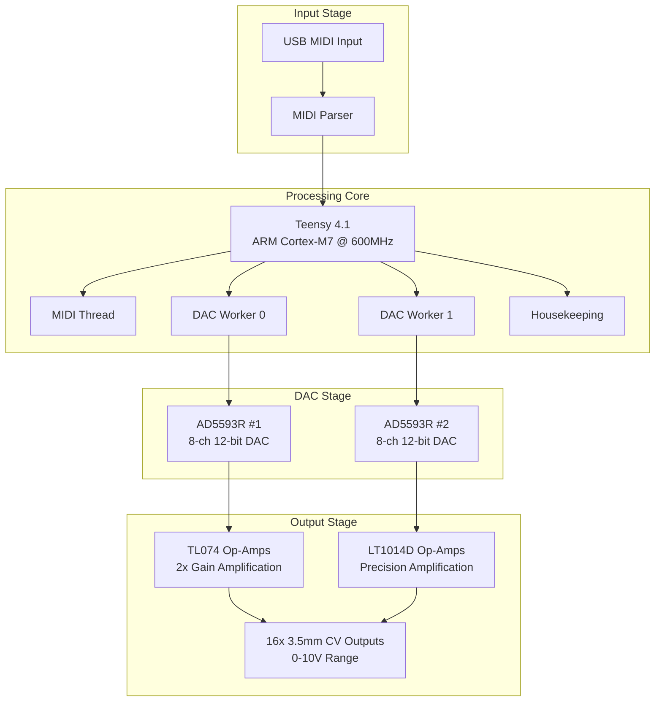

# Master of Muppets - USB MIDI to CV Converter

A professional-grade USB MIDI to 16-channel CV converter built on Teensy 4.1 with AI-assisted development methodology.

## Project Overview

Master of Muppets is a high-performance USB MIDI to CV converter that transforms MIDI pitch bend messages into precise 0-10V control voltages across 16 independent channels. Built on the powerful Teensy 4.1 platform, it delivers sub-millisecond latency suitable for professional audio and modular synthesizer applications.

## Key Features

- **16 Channels**: Independent CV outputs (0-10V range)
- **High Precision**: 12-bit DAC resolution (4096 levels)
- **Low Latency**: 2-3ms total system response time
- **Real-time Performance**: Deterministic threading with TeensyThreads
- **Template Architecture**: Flexible DAC driver system
- **Production Ready**: Comprehensive analysis and optimization

## System Architecture

## Technical Specifications

| Specification | Value |
|---------------|-------|
| **Platform** | Teensy 4.1 (ARM Cortex-M7 @ 600MHz) |
| **Channels** | 16 independent CV outputs |
| **Resolution** | 12-bit (4096 levels) |
| **Output Range** | 0-10V DC |
| **Latency** | <1ms complete signal chain |
| **Interface** | USB MIDI Class Compliant |
| **Power** | USB powered with ±12V for analog stages |
| **Connectors** | 16x 3.5mm mono switched jacks |

## Documentation Structure

### Core System Documentation
- [`overview/`](overview/) - Project overview and architecture
- [`hardware/`](hardware/) - Hardware design and schematics
- [`firmware/`](firmware/) - Firmware architecture and code
- [`components/`](components/) - Component specifications and datasheets
- [`analysis/`](analysis/) - Circuit analysis and optimization
- [`manufacturing/`](manufacturing/) - Production and deployment guides

### Development & AI System
- [`development/`](development/) - Development methodology and tools
- [`ai_system/`](ai_system/) - **Claude AI system and knowledge management**
  - [`AI_SYSTEM_OVERVIEW.md`](ai_system/AI_SYSTEM_OVERVIEW.md) - Revolutionary AI-assisted development
  - [`contexts/`](ai_system/contexts/) - Intelligent context system
  - [`knowledge_management/`](ai_system/knowledge_management/) - Structured knowledge base
  - [`tools/`](ai_system/tools/) - Analysis tools (900x performance improvement)
  - [`correlations/`](ai_system/correlations/) - Cross-domain optimization

## Quick Start

1. **Hardware Setup**: Connect Teensy 4.1 to DAC modules and amplifier stages
2. **Firmware Upload**: Use PlatformIO to compile and upload firmware
3. **MIDI Connection**: Connect USB MIDI source to Teensy
4. **CV Outputs**: Connect 3.5mm cables to your modular system

## Revolutionary AI-Assisted Development

This project demonstrates breakthrough AI-assisted collaborative development methodology:

### Claude AI System Achievements
- **900x Performance Improvement**: Automated circuit analysis (2 hours → 8 seconds)
- **19 Comprehensive Knowledge Files**: Structured technical information across all domains
- **Cross-Domain Correlations**: Hardware-firmware-algorithm integration optimization
- **Intelligent Context System**: Automatic knowledge loading and AI assistance
- **Production-Ready Analysis Tools**: Open-source KiCad hierarchical parsing

### Development Innovation
- **Knowledge-First Methodology**: Comprehensive knowledge creation before implementation
- **Automated Tool Documentation**: Mandatory knowledge files for all created tools
- **Real-Time Analysis**: Graph theory application to circuit optimization
- **Structured Knowledge Management**: JSON-based technical information system

## Current Status

**Season 04 - Production Optimization**: Ultimate comprehensive analysis achieved with production-ready deployment capabilities.

## License

MIT License - See LICENSE file for details

## Community Impact

### Open Source Contributions
- **KiCad Hierarchical Parser**: First production-ready tool for complex hierarchical schematics
- **Graph-Based Circuit Analysis**: Novel mathematical approach to hardware optimization
- **AI Development Methodology**: Reproducible human-AI collaboration patterns
- **Comprehensive Knowledge Templates**: Structured knowledge management framework

### Educational Resources
- Complete AI-assisted development methodology documentation
- 900x performance improvement case studies
- Cross-domain correlation analysis examples
- Production-ready embedded systems development guide

---

*Developed with Claude AI assistance using structured knowledge management and cross-domain correlation analysis.*