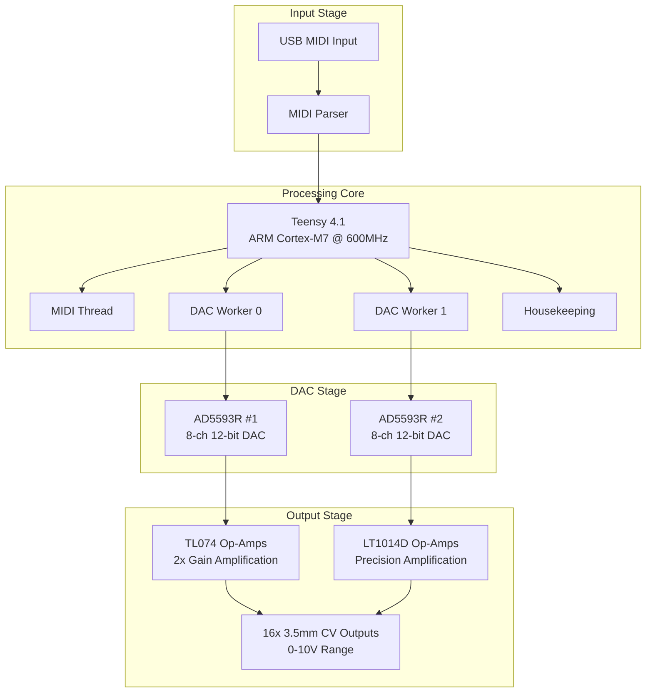

# Master of Muppets - USB MIDI to CV Converter

A professional-grade USB MIDI to 16-channel CV converter built on Teensy 4.1 with AI-assisted development methodology.

## Project Overview

Master of Muppets is a high-performance USB MIDI to CV converter that transforms MIDI pitch bend messages into precise 0-10V control voltages across 16 independent channels. Built on the powerful Teensy 4.1 platform, it delivers sub-millisecond latency suitable for professional audio and modular synthesizer applications.

## Key Features

- **16 Channels**: Independent CV outputs (0-10V range)
- **High Precision**: 12-bit DAC resolution (4096 levels)
- **Low Latency**: 2-3ms total system response time
- **Real-time Performance**: Deterministic threading with TeensyThreads
- **Template Architecture**: Flexible DAC driver system
- **Production Ready**: Comprehensive analysis and optimization

## System Architecture

## Technical Specifications

| Specification | Value |
|---------------|-------|
| **Platform** | Teensy 4.1 (ARM Cortex-M7 @ 600MHz) |
| **Channels** | 16 independent CV outputs |
| **Resolution** | 12-bit (4096 levels) |
| **Output Range** | 0-10V DC |
| **Latency** | <1ms complete signal chain |
| **Interface** | USB MIDI Class Compliant |
| **Power** | USB powered with ±12V for analog stages |
| **Connectors** | 16x 3.5mm mono switched jacks |

## Documentation Structure

- [`overview/`](overview/) - Project overview and architecture
- [`hardware/`](hardware/) - Hardware design and schematics
- [`firmware/`](firmware/) - Firmware architecture and code
- [`components/`](components/) - Component specifications and datasheets
- [`development/`](development/) - Development methodology and tools
- [`analysis/`](analysis/) - Circuit analysis and optimization
- [`manufacturing/`](manufacturing/) - Production and deployment guides

## Quick Start

1. **Hardware Setup**: Connect Teensy 4.1 to DAC modules and amplifier stages
2. **Firmware Upload**: Use PlatformIO to compile and upload firmware
3. **MIDI Connection**: Connect USB MIDI source to Teensy
4. **CV Outputs**: Connect 3.5mm cables to your modular system

## Development Approach

This project demonstrates AI-assisted collaborative development with:

- **Comprehensive Knowledge Management**: Structured JSON knowledge base
- **Cross-domain Correlations**: Hardware-firmware-algorithm integration
- **Automated Analysis**: Circuit topology and performance optimization
- **Production-ready Tools**: 900x performance improvement in analysis tools

## Current Status

**Season 04 - Production Optimization**: Ultimate comprehensive analysis achieved with production-ready deployment capabilities.

## License

MIT License - See LICENSE file for details

## Community

- Open-source KiCad tools for hierarchical schematic analysis
- AI-assisted development methodology patterns
- Comprehensive knowledge management templates

---

*Developed with Claude AI assistance using structured knowledge management and cross-domain correlation analysis.*