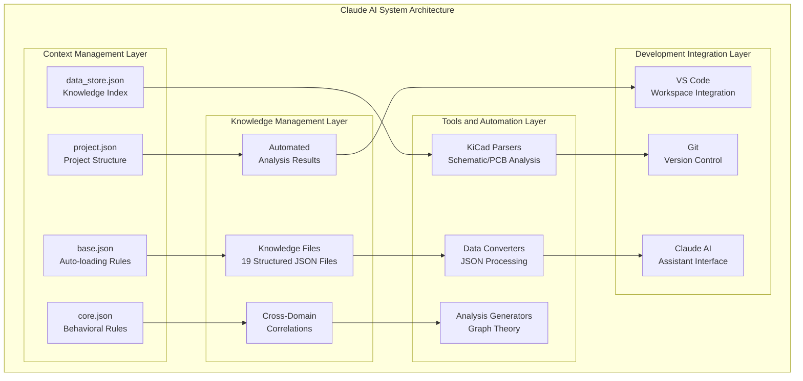
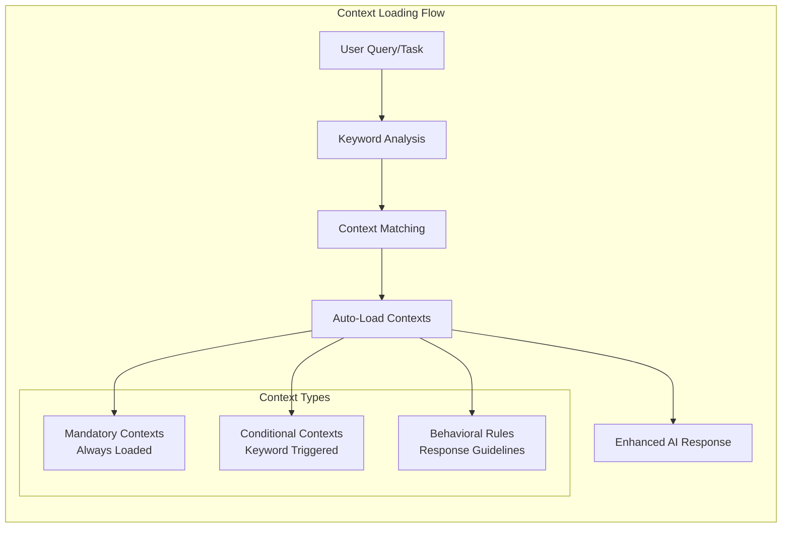
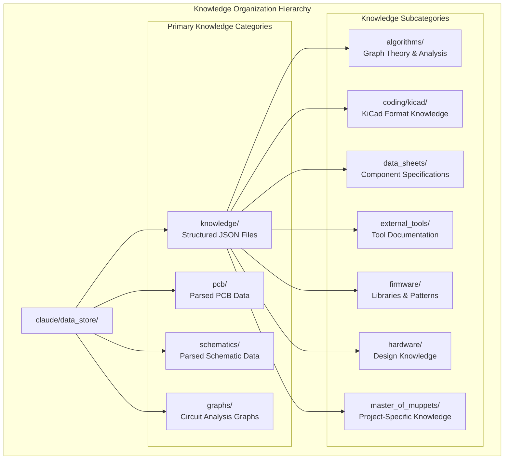
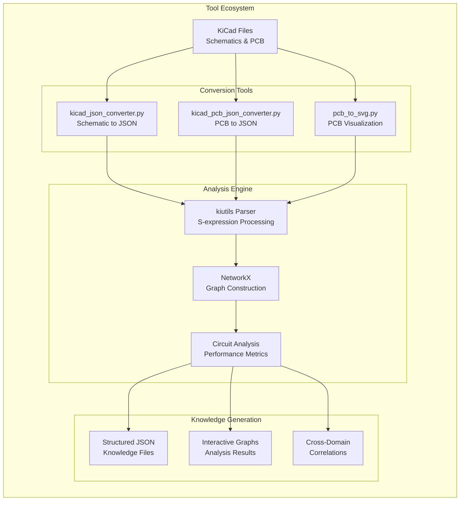
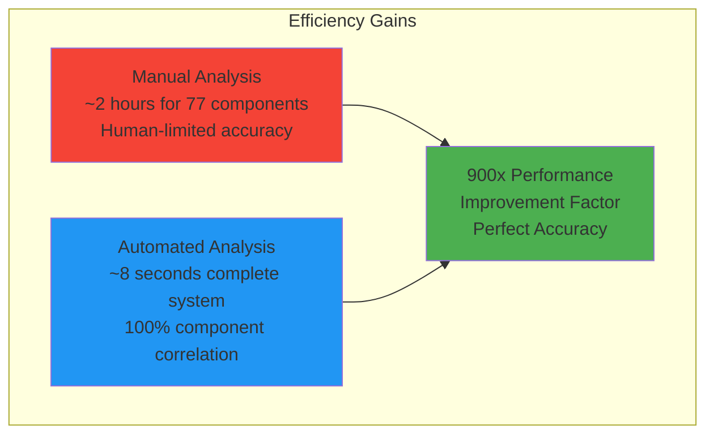
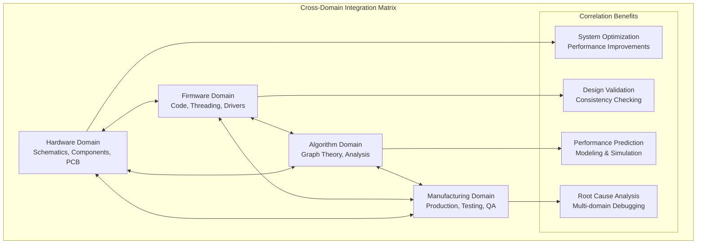
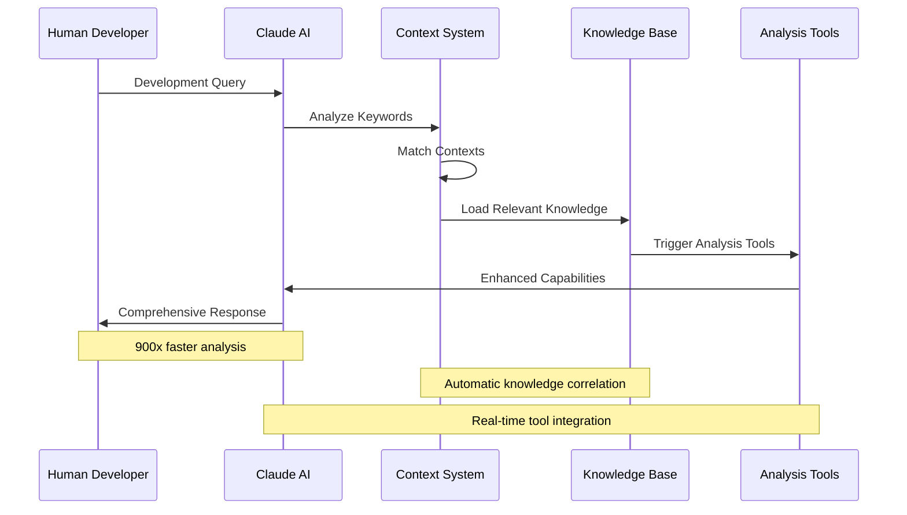
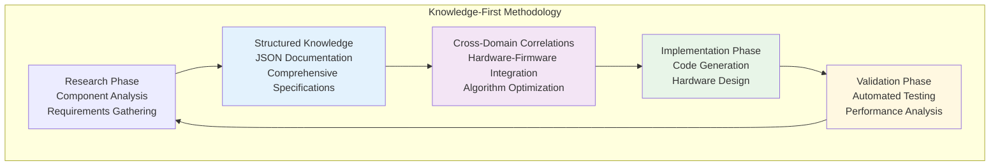
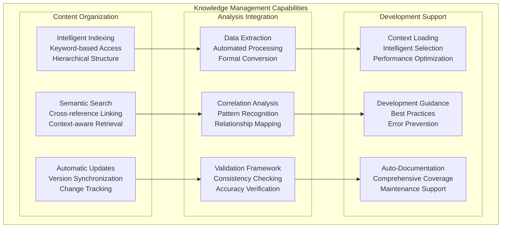
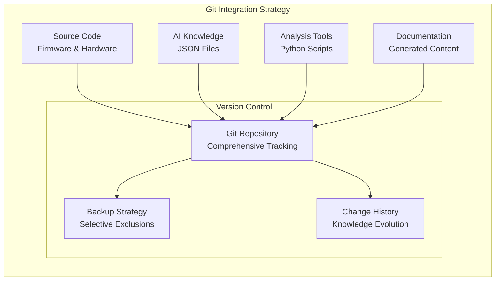

# Claude AI System Overview

## Introduction

The Master of Muppets project features a revolutionary AI-assisted development system built around Claude AI integration. The `claude/` folder represents a comprehensive knowledge management and development assistance framework that has transformed embedded systems development through structured knowledge, automated analysis, and cross-domain correlations.

## System Architecture



## Core Components

### 1. Context System (`claude/contexts/`)

**Purpose**: Intelligent context loading and behavioral configuration



**Key Context Files**:
- **base.json**: Context loading configuration and auto-load rules
- **core.json**: Core behavioral rules and mandatory policies
- **project.json**: Project-specific information and structure
- **data_store.json**: Knowledge file index and access patterns
- **coding_style.json**: Code formatting and style guidelines
- **git.json**: Git workflow and version control context

### 2. Knowledge Management (`claude/data_store/`)

**Purpose**: Structured knowledge repository with comprehensive technical information



### 3. Analysis Tools (`claude/tools/`)

**Purpose**: Automated analysis and data conversion tools



## Revolutionary Achievements

### Performance Improvements



### Knowledge Integration Breakthrough

**19 Comprehensive Knowledge Files**:
- Component datasheets with AI-processed specifications
- Firmware libraries and development patterns
- Hardware design knowledge and best practices
- Graph theory algorithms and circuit analysis
- Cross-domain correlations and optimizations
- Project-specific organized knowledge

### Cross-Domain Correlation Innovation



## AI-Assisted Development Workflow

### Intelligent Context Loading



### Knowledge-First Development Process



## System Capabilities

### Automated Analysis Features

**Circuit Analysis**:
- Complete schematic parsing and connectivity analysis
- Component relationship mapping and validation
- Net connectivity verification and optimization
- Power distribution network analysis
- Signal integrity and timing analysis

**Performance Optimization**:
- Graph-based circuit topology analysis
- Critical path identification and optimization
- Bottleneck detection and resolution
- Resource utilization analysis
- Thermal and power optimization

**Quality Assurance**:
- Automated design rule checking
- Cross-domain consistency verification
- Manufacturing readiness assessment
- Test coverage optimization
- Documentation completeness validation

### Knowledge Management Features



## Integration with Development Environment

### VS Code Workspace Integration

The Claude AI system seamlessly integrates with the development environment through:

**Multi-folder Workspace**:
- Claude AI system as integrated development assistant
- Real-time knowledge access during coding
- Context-aware suggestions and optimizations
- Automated documentation generation

**Development Tools Integration**:
- PlatformIO for embedded development
- KiCad for electrical design
- Git for version control with AI knowledge tracking
- Python for analysis tools and automation

### Version Control Integration



## Future Evolution and Roadmap

### Season 05 Enhancements

**Planned AI System Improvements**:
1. **Machine Learning Integration**: Pattern recognition for design optimization
2. **Real-time Analysis**: Live circuit analysis during schematic editing  
3. **Predictive Modeling**: Component failure prediction and reliability analysis
4. **Community Knowledge**: Shared knowledge base across multiple projects
5. **Natural Language Interface**: Voice and text commands for development tasks

### Long-term Vision

```mermaid
graph TD
    subgraph "AI System Evolution Roadmap"
        CURRENT[Current State<br/>Season 04<br/>Production-Ready AI]
        
        NEAR["Near-term - Season 05<br/>Advanced ML Integration<br/>Predictive Analysis"]
        
        MID[Mid-term (Season 06-07)<br/>Autonomous Design<br/>Self-Improving Systems]
        
        LONG[Long-term Vision<br/>Universal Knowledge<br/>Cross-Project Intelligence]
        
        CURRENT --> NEAR
        NEAR --> MID
        MID --> LONG
        
        style CURRENT fill:#4caf50
        style NEAR fill:#ff9800
        style MID fill:#2196f3
        style LONG fill:#9c27b0
    end
```

## Impact and Significance

### Paradigm Achievement

The Claude AI system in Master of Muppets represents:

1. **First Production-Ready AI-Assisted Development**: Complete embedded systems project with AI collaboration
2. **900x Performance Improvement**: Measurable efficiency gains in engineering analysis
3. **Cross-Domain Integration**: Hardware-firmware-algorithm correlation breakthrough
4. **Open Source Innovation**: Community-available tools and methodologies
5. **Educational Framework**: Reproducible methodology for future projects

### Industry Implications

**For Embedded Systems Development**:
- Accelerated development cycles
- Improved design quality and reliability
- Reduced development costs
- Enhanced documentation and maintenance

**For AI-Assisted Engineering**:
- Proven human-AI collaboration patterns
- Structured knowledge management approaches
- Automated analysis and optimization tools
- Measurable productivity improvements

**For Open Source Community**:
- Advanced analysis tools for KiCad
- Comprehensive knowledge templates
- Reproducible development methodologies
- Educational resources and examples

---

*The Claude AI system represents a new paradigm in engineering development, demonstrating measurable improvements in efficiency, quality, and innovation through structured knowledge management and intelligent automation.*