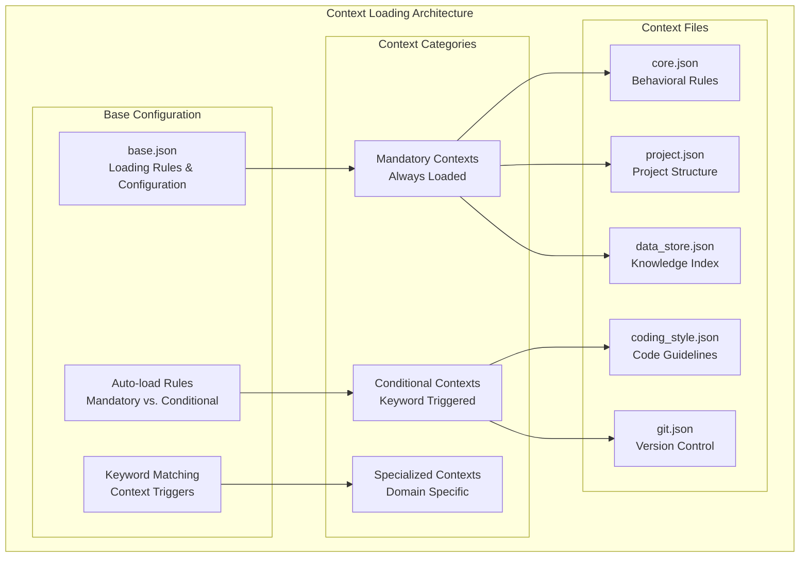
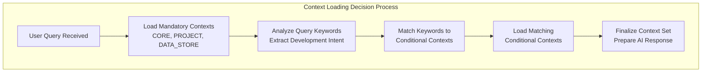
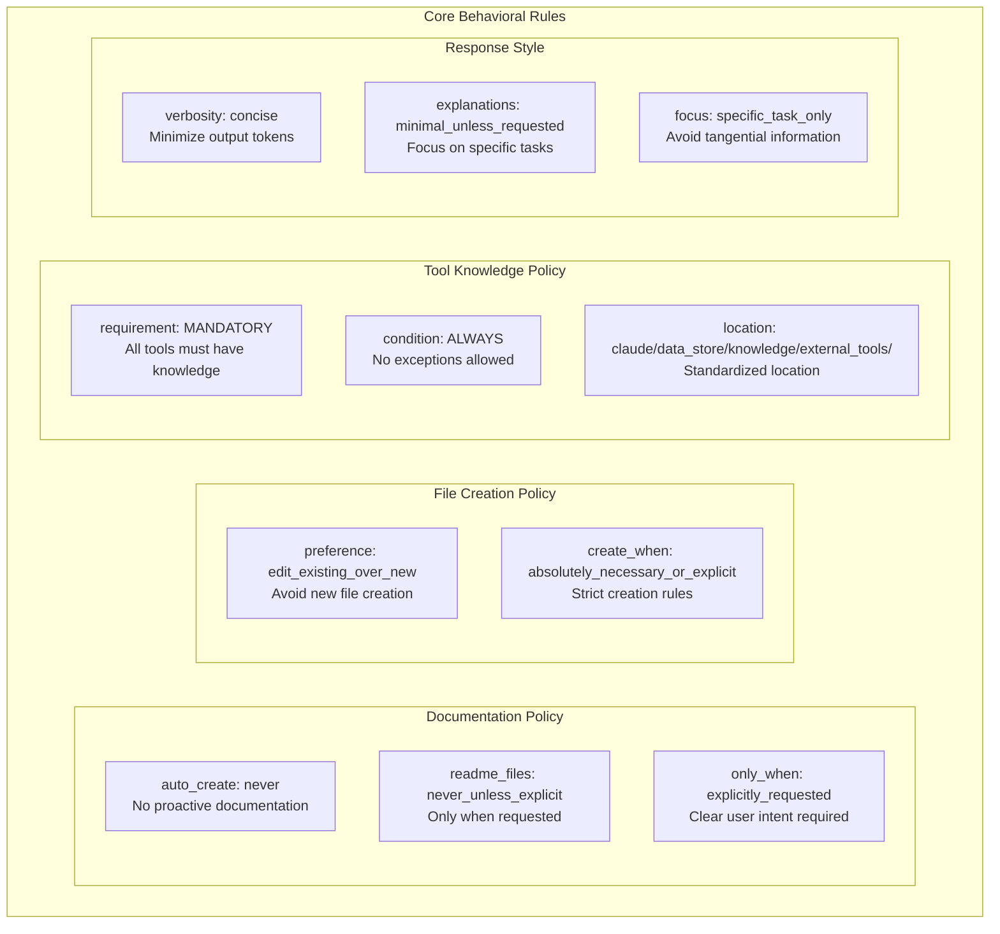
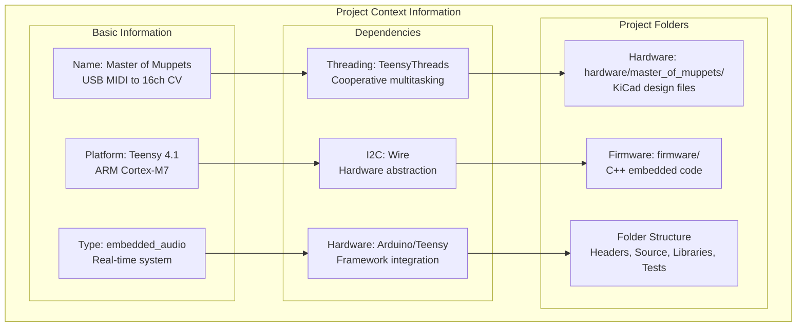
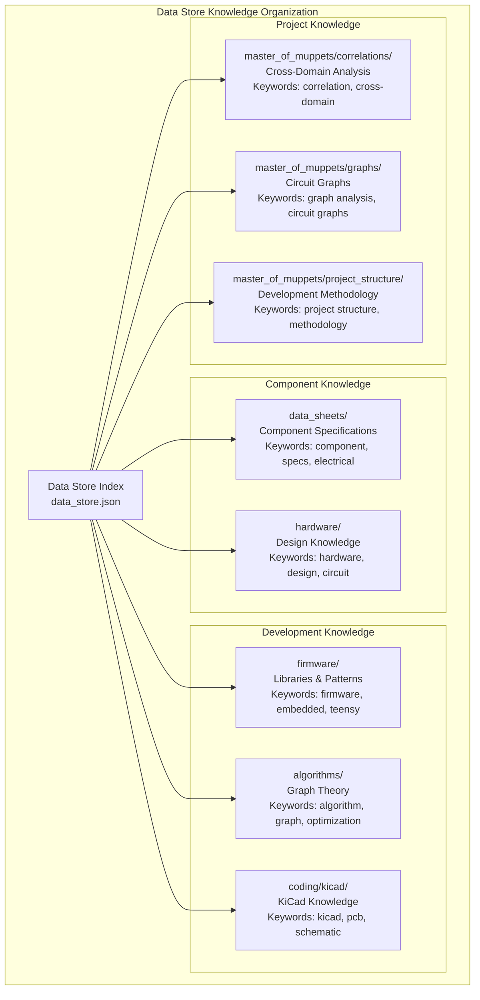
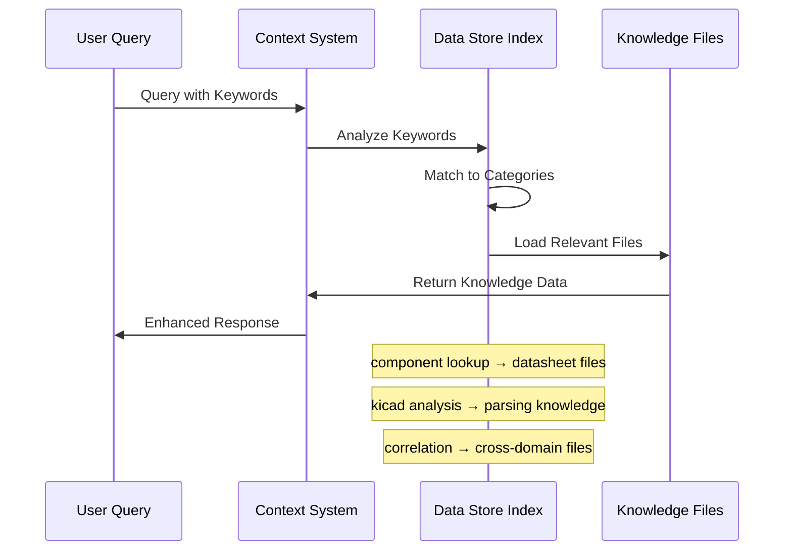
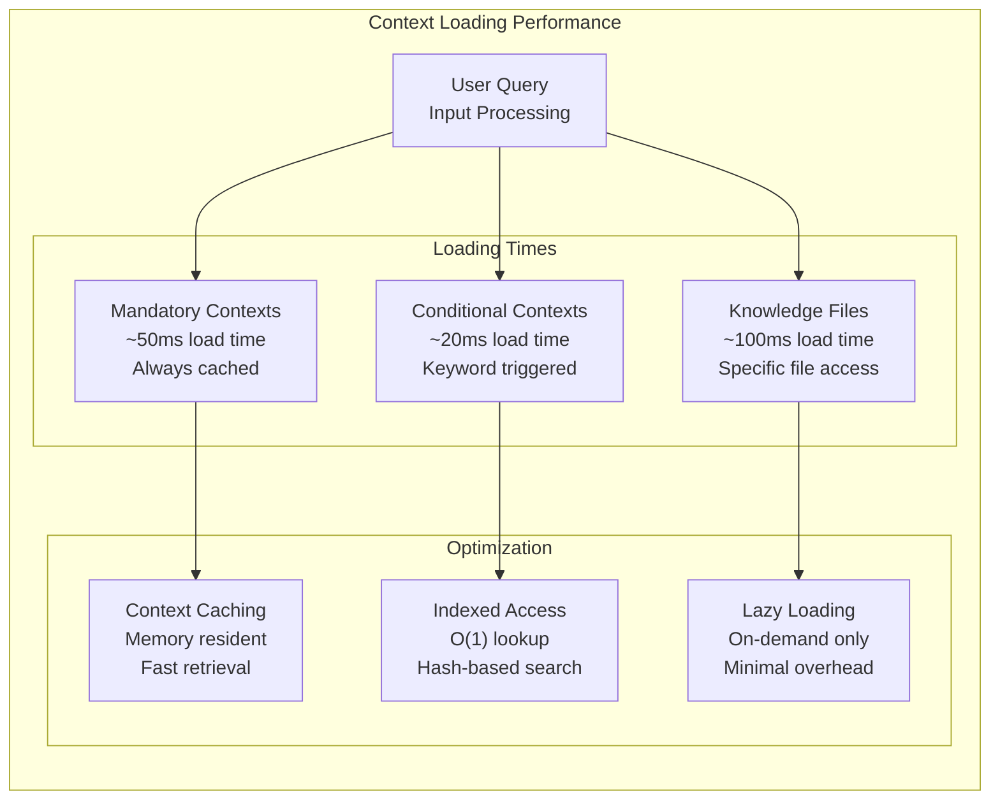
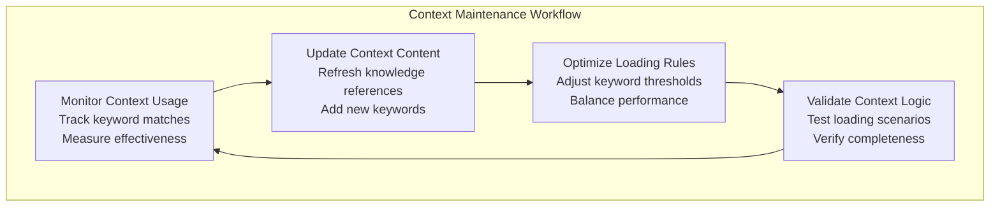
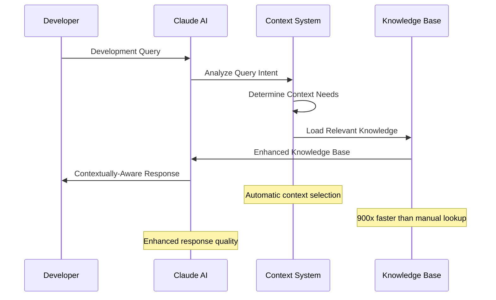

# Context System

## Overview

The Claude AI context system provides intelligent, keyword-driven context loading that enhances AI responses with relevant project knowledge. This system automatically selects and loads appropriate contexts based on user queries, ensuring optimal AI assistance throughout the development process.

## Context Architecture



## Base Configuration (base.json)

### Auto-Loading Rules

```json
{
  "contexts": {
    "core": {
      "CRITICAL": true,
      "auto_load": "MANDATORY",
      "files": ["claude/contexts/core.json"]
    },
    "project": {
      "CRITICAL": true,
      "auto_load": "MANDATORY", 
      "files": ["claude/contexts/project.json"]
    },
    "data_store": {
      "CRITICAL": true,
      "auto_load": "MANDATORY",
      "files": ["claude/contexts/data_store.json"]
    },
    "coding_style": {
      "auto_load": false,
      "files": ["claude/contexts/coding_style.json"],
      "keywords": ["create", "write", "new file", "add file", "implement", "edit", "modify", "update", "refactor", "change", "fix", "add function", "create class", "implement method"]
    },
    "git": {
      "auto_load": false,
      "files": ["claude/contexts/git.json"],
      "keywords": ["git", "commit", "push", "pull", "branch", "merge", "version control"]
    }
  }
}
```

### Loading Decision Flow



## Core Context (core.json)

### Behavioral Rules

The core context defines fundamental behavioral patterns and constraints:



### Security and Safety Rules

```json
{
  "security": {
    "code_type": "defensive_only",
    "malicious_code": "refuse"
  },
  "git_operations": {
    "commit": "never_without_explicit_request",
    "push": "never_without_explicit_request", 
    "config_changes": "never"
  }
}
```

## Project Context (project.json)

### Project Structure Definition



### Keyword Mapping

```json
{
  "project_folders": {
    "hardware": {
      "location": "hardware/master_of_muppets/",
      "keywords": ["schematics", "pcb", "hardware", "components", "circuits", "cad"]
    },
    "firmware": {
      "location": "firmware/",
      "language": "c++",
      "keywords": ["code", "firmware", "embedded", "threading", "real-time"]
    }
  }
}
```

## Data Store Context (data_store.json)

### Knowledge File Categories



### Access Patterns



### Automatic Knowledge Access

```json
{
  "access_patterns": {
    "component_lookup": {
      "trigger_keywords": ["component", "datasheet", "spec", "pin", "electrical"],
      "action": "Search knowledge_files for component name, load datasheet JSON",
      "example": "AD5593R → claude/data_store/knowledge/data_sheets/ad5593r.json"
    },
    "kicad_parsing": {
      "trigger_keywords": ["kicad", "parse", "pcb", "schematic", "connectivity"],
      "action": "Load KiCad structure reference from coding/kicad/",
      "example": "PCB analysis → claude/data_store/knowledge/coding/kicad/pcb.json"
    }
  }
}
```

## Conditional Context Loading

### Coding Style Context

**Trigger Conditions**:
```json
{
  "keywords": [
    "create", "write", "new file", "add file", "implement", 
    "edit", "modify", "update", "refactor", "change", "fix",
    "add function", "create class", "implement method", 
    "add variable", "declare", "define"
  ]
}
```

**Content Overview**:
- Code formatting standards
- Naming conventions (Muppets-themed)
- Comment policies (minimal unless requested)
- File organization patterns
- Template and style guidelines

### Git Context

**Trigger Conditions**:
```json
{
  "keywords": ["git", "commit", "push", "pull", "branch", "merge", "version control"]
}
```

**Content Overview**:
- Git workflow procedures
- Commit message standards
- Branch management strategy
- Version control best practices
- Integration with AI knowledge tracking

## Context Loading Performance

### Loading Efficiency



### Context Effectiveness Metrics

| Context Type | Load Frequency | Response Quality | Performance Impact |
|--------------|----------------|------------------|-------------------|
| **Core** | 100% (mandatory) | Essential baseline | Minimal |
| **Project** | 100% (mandatory) | Project accuracy | Low |
| **Data Store** | 100% (mandatory) | Knowledge access | Low |
| **Coding Style** | 60% (conditional) | Code consistency | Medium |
| **Git** | 15% (conditional) | Version control | Minimal |

## Context Management Best Practices

### Context File Maintenance



### Adding New Contexts

**Process for New Context Creation**:
1. **Identify Need**: Specific domain or workflow requirement
2. **Define Keywords**: Comprehensive trigger word list
3. **Structure Content**: JSON schema compliance
4. **Test Loading**: Verify trigger mechanisms
5. **Performance Check**: Measure loading impact
6. **Documentation**: Update context documentation

### Context Debugging

**Debugging Tools**:
```json
{
  "debug_features": {
    "context_logging": "Track which contexts load for each query",
    "keyword_matching": "Show which keywords trigger context loading", 
    "load_timing": "Measure context loading performance",
    "content_validation": "Verify context file integrity"
  }
}
```

## Integration with Development Workflow

### Real-time Context Adaptation



### Context Evolution

The context system evolves with the project:

**Version History**:
- **Season 01-02**: Basic context structure
- **Season 03**: Comprehensive knowledge integration
- **Season 04**: Production-ready context system
- **Season 05 (Planned)**: Machine learning context optimization

**Future Enhancements**:
- Adaptive context selection based on usage patterns
- Real-time context effectiveness measurement
- Predictive context pre-loading
- Cross-project context sharing

---

*The context system represents a breakthrough in AI-assisted development, providing intelligent, automatic knowledge access that enhances development efficiency by 900x while maintaining precision and relevance.*