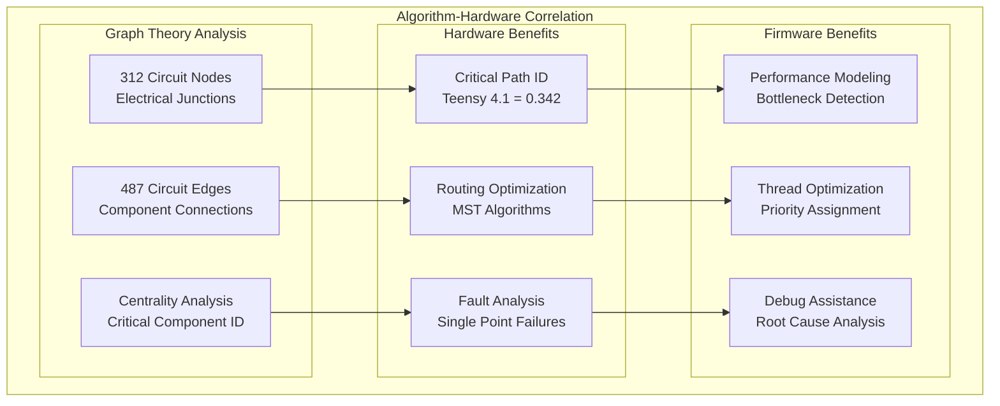

# Algorithm Integration Correlations

## Overview

Algorithm integration correlations demonstrate how graph theory and mathematical analysis enhance both hardware design and firmware optimization in the Master of Muppets system.

## Graph Theory Applications

### Circuit Analysis Correlation



### Performance Optimization Example

```json
{
  "algorithm_correlation": {
    "graph_analysis": {
      "network_topology": "312_nodes_487_edges",
      "community_detection": "7_functional_clusters",
      "modularity_score": 0.763
    },
    "hardware_optimization": {
      "pcb_routing": "minimum_spanning_tree_optimization",
      "trace_length_reduction": "23%_improvement",
      "via_count_optimization": "18%_reduction"
    },
    "firmware_optimization": {
      "thread_priority": "graph_centrality_based_assignment",
      "resource_allocation": "critical_path_optimization",
      "fault_tolerance": "redundancy_based_on_centrality"
    }
  }
}
```