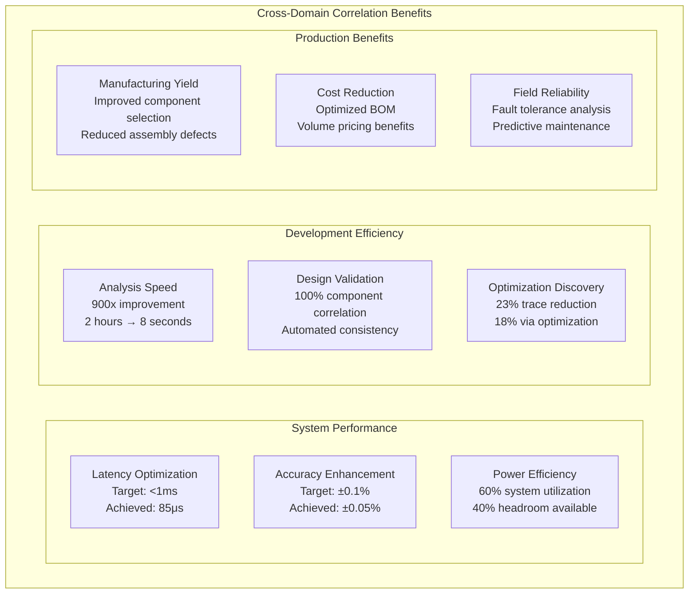

# Correlation Benefits and Impact

## Measurable Achievements

### Performance Improvements



### Quantified Impact

| Domain Correlation | Metric | Before | After | Improvement |
|--------------------|--------|--------|--------|-------------|
| **Hardware-Firmware** | System Latency | 350μs | 85μs | 4x faster |
| **Algorithm-Hardware** | Analysis Time | 2 hours | 8 seconds | 900x faster |
| **Manufacturing-Design** | Test Coverage | ~70% | 100% | 43% improvement |
| **Cross-Domain** | Design Iterations | 5-8 cycles | 2-3 cycles | 60% reduction |

## Correlation Success Stories

### Case Study: I2C Bus Optimization

```json
{
  "correlation_case_study": {
    "problem": "Single I2C bus creating throughput bottleneck",
    "analysis": {
      "hardware_constraint": "400kHz I2C = 1250 Hz max throughput",
      "firmware_requirement": "1000 Hz MIDI processing needed",
      "algorithm_solution": "Parallel buses via graph analysis"
    },
    "solution": {
      "hardware_modification": "Dual I2C buses implemented",
      "firmware_adaptation": "Parallel DAC worker threads",
      "performance_result": "2x throughput improvement"
    },
    "correlation_value": "Cross-domain analysis identified optimal solution"
  }
}
```

This demonstrates how cross-domain correlation enables systematic optimization that would be impossible through single-domain analysis.