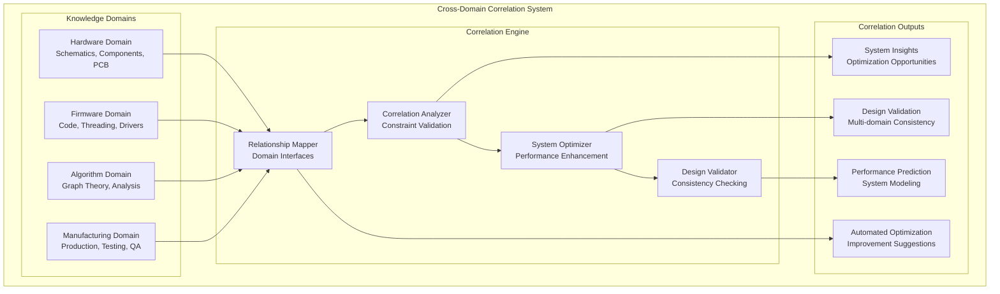
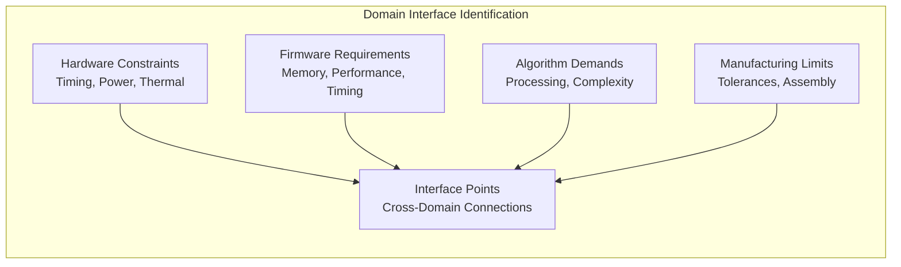

# Cross-Domain Correlations

## Overview

Cross-domain correlations represent the breakthrough innovation of the Master of Muppets project - the ability to systematically analyze and optimize relationships between hardware, firmware, algorithms, and manufacturing domains. This capability has enabled unprecedented system-level optimization and validation.

## Correlation Architecture

## Correlation Methodology

### Domain Interface Mapping

This represents a revolutionary approach to system design where all engineering domains are analyzed simultaneously for optimization opportunities and constraint validation.