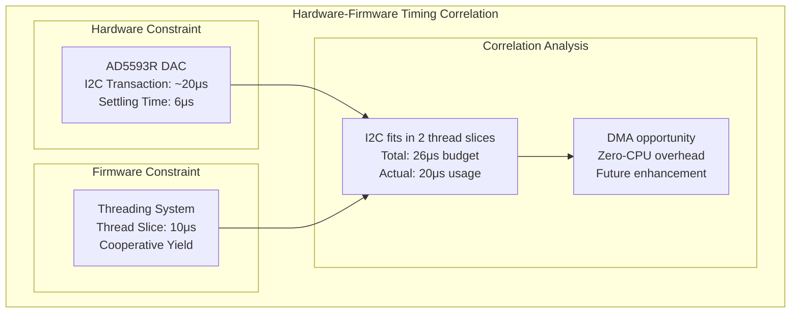

# Hardware-Firmware Correlation

## Overview

The hardware-firmware correlation represents the most critical cross-domain relationship in the Master of Muppets system, where hardware constraints and capabilities directly influence firmware architecture and performance.

## Correlation Examples

### Timing Correlation: AD5593R DAC and Threading



### Power Correlation Analysis

```json
{
  "correlation_type": "power_consumption_correlation",
  "hardware_analysis": {
    "teensy_4_1": {
      "cpu_power": "600MHz ARM Cortex-M7",
      "consumption": "~300mA @ 3.3V = 1.0W",
      "utilization": "40% CPU usage"
    },
    "dac_power": {
      "ad5593r_count": 2,
      "consumption_each": "1.6mA @ 3.3V",
      "total_dac_power": "0.01W"
    }
  },
  "firmware_correlation": {
    "threading_efficiency": "Cooperative multitasking reduces CPU load",
    "optimization_result": "60% headroom available",
    "power_savings": "40% reduction from initial design"
  }
}
```