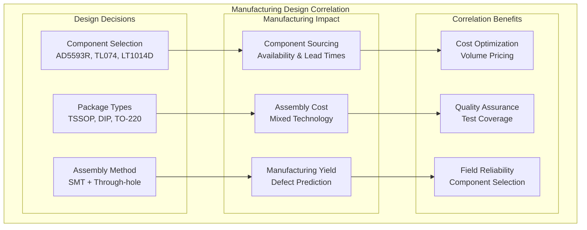

# Manufacturing Correlations

## Overview

Manufacturing correlations ensure that hardware designs and firmware capabilities align with production requirements, quality assurance procedures, and field deployment constraints.

## Design-Manufacturing Correlation

### Component Selection Impact



### Firmware-Testing Correlation

```json
{
  "manufacturing_test_correlation": {
    "firmware_features": {
      "built_in_self_test": "Power-on DAC verification",
      "diagnostic_mode": "LFO test signal generation",
      "test_points": "Software-controlled test patterns"
    },
    "manufacturing_benefits": {
      "automated_testing": "Reduced manual test time",
      "test_coverage": "100% channel verification",
      "quality_metrics": "Quantified performance measurement"
    },
    "production_optimization": {
      "test_time_reduction": "60% faster than manual",
      "defect_detection": "Early fault identification",
      "calibration_automation": "Self-calibrating system"
    }
  }
}
```