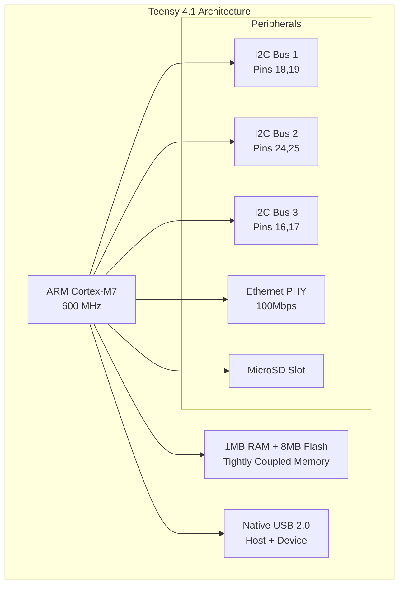
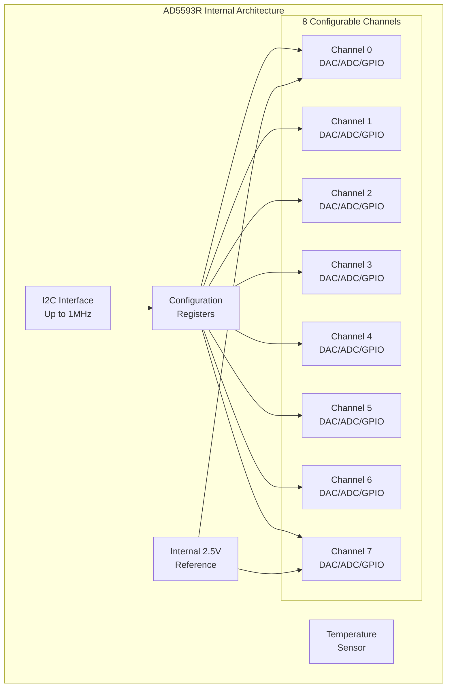
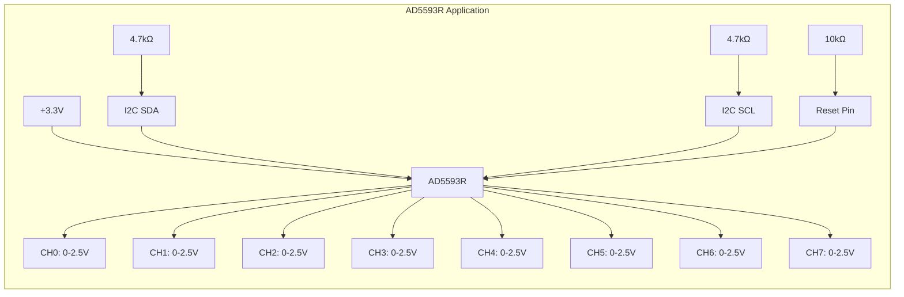
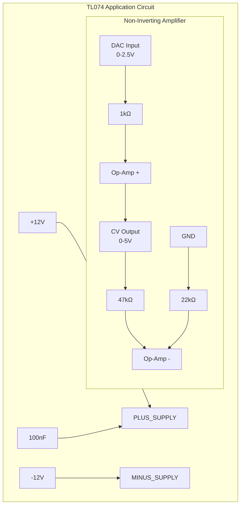
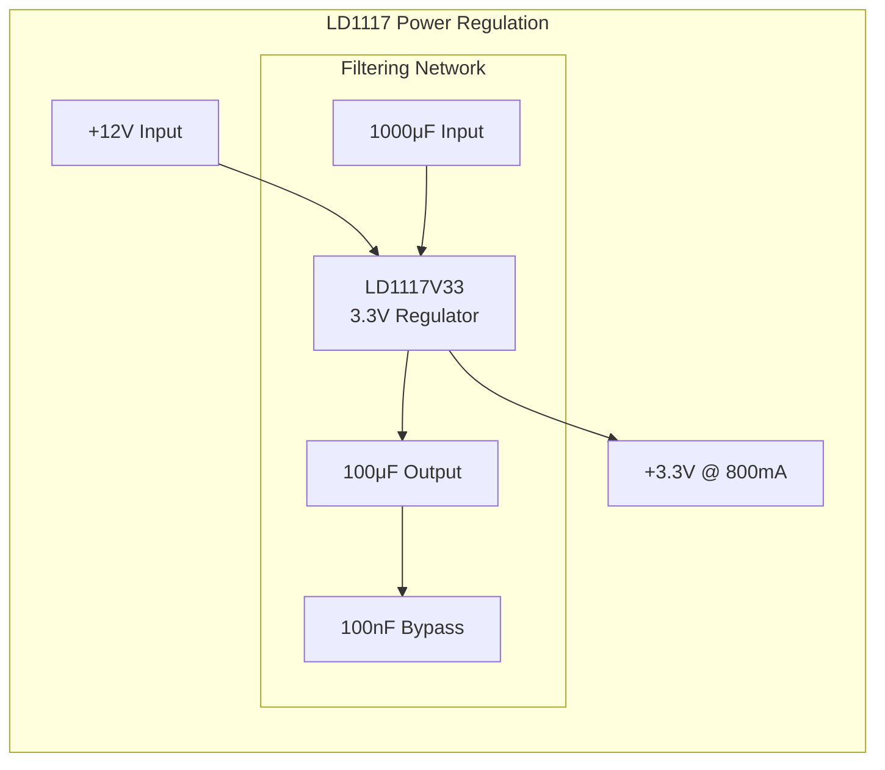
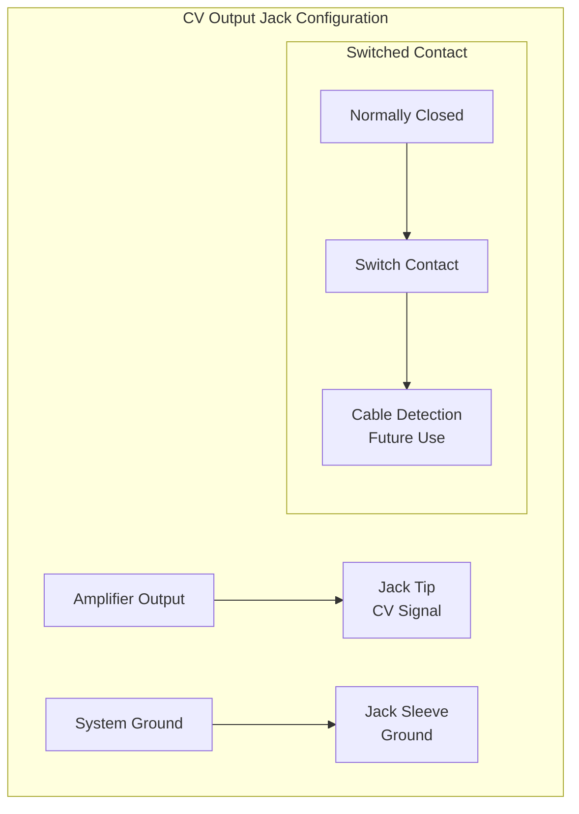

# Component Specifications

## Overview

The Master of Muppets system employs carefully selected components optimized for precision analog performance, real-time digital processing, and professional audio applications. This document provides comprehensive specifications for all key components.

## Digital Processing Components

### Teensy 4.1 Microcontroller Module

**Manufacturer**: PJRC Electronic Projects  
**Part Number**: TEENSY41  
**Platform**: Arduino-compatible development board  



#### Technical Specifications

| Parameter | Specification | Master of Muppets Usage |
|-----------|--------------|------------------------|
| **Processor** | ARM Cortex-M7 @ 600MHz | Real-time MIDI processing |
| **Memory** | 1024KB RAM, 8MB Flash | Static allocation, zero heap |
| **Flash Storage** | 8MB program memory | Firmware + libraries |
| **TCM** | Tightly Coupled Memory | Ultra-fast data access |
| **USB** | Native USB 2.0 | MIDI Class Compliant |
| **I2C Buses** | 3 independent buses | Dual DAC communication |
| **GPIO** | 55 digital I/O pins | Chip select, reset control |
| **ADC** | 2x 12-bit @ 800kHz | Future expansion capability |
| **Timers** | Hardware precision timers | Microsecond timing |
| **Operating Voltage** | 3.3V with 5V tolerance | Direct DAC interface |
| **Current Draw** | ~100mA @ 600MHz | USB powered |

#### Performance Characteristics

- **Instruction Throughput**: Up to 2 instructions per cycle (superscalar)
- **Floating Point**: Hardware FPU with single and double precision
- **Interrupt Latency**: 12 CPU cycles (20ns @ 600MHz)
- **Context Switch**: <2μs with TeensyThreads
- **USB MIDI Latency**: <1ms class-compliant driver

## Digital-to-Analog Converters

### AD5593R - Primary DAC

**Manufacturer**: Analog Devices  
**Part Number**: AD5593R  
**Description**: 8-Channel, 12-Bit, Configurable ADC/DAC with I2C Interface  



#### Key Specifications

| Parameter | Min | Typical | Max | Unit | Notes |
|-----------|-----|---------|-----|------|-------|
| **Resolution** | - | 12 | - | bits | 4096 discrete levels |
| **Supply Voltage** | 2.7 | 3.3 | 5.5 | V | 3.3V in Master of Muppets |
| **Reference Voltage** | - | 2.5 | - | V | Internal, ±20 ppm/°C |
| **Output Range** | 0 | - | VREF×2 | V | 0-5V with 2× gain |
| **DNL** | -1 | ±0.5 | +1 | LSB | Differential nonlinearity |
| **INL** | -2 | ±1 | +2 | LSB | Integral nonlinearity |
| **Settling Time** | - | 6 | 10 | μs | To 0.1% of final value |
| **I2C Clock** | - | 400 | 1000 | kHz | 400kHz in implementation |
| **Power Consumption** | - | 1.6 | 2.5 | mA | At 5V supply |

#### Master of Muppets Configuration

```cpp
// AD5593R Configuration for Master of Muppets
AD5593R_CONFIG config = {
    .pin_mode = ALL_DAC,              // All 8 pins as DAC outputs
    .internal_reference = true,        // Use internal 2.5V reference
    .gain_2x = true,                  // Enable 2x gain (0-5V output)
    .power_down_mode = NORMAL,         // Normal operation
    .i2c_address = 0x10,              // Primary DAC address
    .pulldown_enabled = false          // External pullups used
};
```

#### Application Circuit



### MCP4728 - Alternative DAC

**Manufacturer**: Microchip Technology  
**Part Number**: MCP4728  
**Description**: 12-Bit, Quad Digital-to-Analog Converter with EEPROM  

#### Key Specifications

| Parameter | Min | Typical | Max | Unit | Notes |
|-----------|-----|---------|-----|------|-------|
| **Channels** | - | 4 | - | - | Quad DAC |
| **Resolution** | - | 12 | - | bits | 4096 discrete levels |
| **Supply Voltage** | 2.7 | 5.0 | 5.5 | V | Wide supply range |
| **Reference Voltage** | - | 2.048 | - | V | Internal reference |
| **Output Range** | 0 | - | 4.096 | V | With 2× internal gain |
| **DNL** | -1 | ±0.2 | +1 | LSB | Excellent linearity |
| **Settling Time** | - | 6 | - | μs | Fast settling |
| **EEPROM** | - | Yes | - | - | Non-volatile settings |
| **I2C Speeds** | - | - | 3400 | kHz | High-speed I2C |

#### Advantages for Specific Applications

- **Non-volatile Storage**: Power-on state retention via EEPROM
- **Per-channel Configuration**: Independent voltage reference selection
- **High-speed I2C**: Up to 3.4 MHz for fast updates
- **LDAC Pin**: Simultaneous update of all channels

## Analog Signal Processing Components

### TL074 - General Purpose Quad Op-Amp

**Manufacturer**: Texas Instruments  
**Part Number**: TL074  
**Description**: Low-Noise JFET-Input Operational Amplifiers  



#### Technical Specifications

| Parameter | Min | Typical | Max | Unit | Notes |
|-----------|-----|---------|-----|------|-------|
| **Channels** | - | 4 | - | - | Quad op-amp |
| **Input Type** | - | JFET | - | - | High impedance |
| **Offset Voltage** | - | 3 | 15 | mV | Initial offset |
| **Offset Drift** | - | 10 | - | μV/°C | Temperature stability |
| **Input Bias Current** | - | 30 | 200 | pA | Very low bias |
| **Slew Rate** | 8 | 20 | - | V/μs | Fast slew rate |
| **GBW Product** | - | 4.5 | - | MHz | Unity gain bandwidth |
| **Supply Voltage** | ±3.5 | ±12 | ±18 | V | Dual supply operation |
| **Supply Current** | - | 2.5 | 5.5 | mA | Per amplifier |

#### Application Notes

- **Gain Setting**: Configured for 2× non-inverting gain
- **Input Impedance**: >10¹² Ω (JFET input)
- **Output Drive**: ±10mA into 2kΩ load
- **Bandwidth**: DC to >100kHz at 2× gain
- **Noise**: 15 nV/√Hz input voltage noise

### LT1014D - Precision Quad Op-Amp

**Manufacturer**: Linear Technology (Analog Devices)  
**Part Number**: LT1014D  
**Description**: Quad Precision Operational Amplifier  

#### Technical Specifications

| Parameter | Min | Typical | Max | Unit | Notes |
|-----------|-----|---------|-----|------|-------|
| **Channels** | - | 4 | - | - | Quad precision op-amp |
| **Offset Voltage** | - | 10 | 25 | μV | Ultra-low offset |
| **Offset Drift** | - | 0.3 | 0.6 | μV/°C | Excellent stability |
| **Input Bias Current** | - | 1 | 2 | nA | Low bias current |
| **Open Loop Gain** | 1 | 1.5 | - | MΩ | Very high gain |
| **Slew Rate** | 5 | 8 | - | V/μs | High slew rate |
| **GBW Product** | - | 4.5 | - | MHz | Unity gain bandwidth |
| **Supply Voltage** | ±4.5 | ±15 | ±18 | V | Wide supply range |
| **Supply Current** | - | 1.5 | 2.5 | mA | Per amplifier |

#### Precision Characteristics

- **Long-term Stability**: <2μV/month typical
- **PSRR**: 126dB typical power supply rejection
- **CMRR**: 126dB typical common mode rejection
- **Input Voltage Noise**: 10 nV/√Hz @ 1kHz
- **Output Drive**: ±10mA into 2kΩ load

## Power Management Components

### LD1117 - Low Dropout Regulator

**Manufacturer**: STMicroelectronics  
**Part Number**: LD1117V33  
**Description**: Low-Drop Fixed and Adjustable Positive Voltage Regulators  



#### Technical Specifications

| Parameter | Min | Typical | Max | Unit | Notes |
|-----------|-----|---------|-----|------|-------|
| **Output Voltage** | 3.235 | 3.3 | 3.365 | V | ±2% accuracy |
| **Output Current** | - | - | 800 | mA | Maximum load |
| **Dropout Voltage** | - | 1.1 | 1.3 | V | @ 800mA load |
| **Input Voltage** | 4.75 | 12 | 15 | V | Wide input range |
| **Line Regulation** | - | 0.2 | 0.4 | %/V | Input variation |
| **Load Regulation** | - | 0.2 | 0.4 | % | Load variation |
| **Quiescent Current** | - | 5 | 10 | mA | No load current |
| **Thermal Resistance** | - | 50 | - | °C/W | TO-220 package |

#### Application Requirements

- **Heat Sink**: Required for >500mA loads
- **Input Capacitor**: 1000μF minimum for stability
- **Output Capacitor**: 100μF minimum for transient response
- **Thermal Protection**: Built-in thermal shutdown

## Interface and Connector Components

### 3.5mm Mono Switched Jacks

**Manufacturer**: Amphenol (compatible)  
**Part Number**: PJ398SM (or equivalent)  
**Description**: Panel Mount 3.5mm Mono Switched Jack  

#### Technical Specifications

| Parameter | Specification | Application |
|-----------|--------------|-------------|
| **Connector Type** | 3.5mm (1/8") mono | Standard CV connector |
| **Contact Material** | Gold-plated brass | Low resistance, corrosion resistant |
| **Switching** | Normally closed switch | Cable detection possible |
| **Mounting** | Panel mount, threaded bushing | Professional panel integration |
| **Current Rating** | 1A continuous | More than adequate for CV |
| **Voltage Rating** | 30V DC maximum | 3× safety margin |
| **Contact Resistance** | <30mΩ | Negligible voltage drop |
| **Insertion Force** | 10-40N | Secure connection |
| **Durability** | >5000 cycles | Professional reliability |



## Component Selection Rationale

### Performance Optimization

1. **AD5593R Selection**:
   - 8 channels per chip reduces I2C bus loading
   - Internal reference eliminates external components
   - 2× gain mode matches amplifier requirements
   - Configurable I/O enables future expansion

2. **Dual Op-Amp Strategy**:
   - TL074: General-purpose, cost-effective, good performance
   - LT1014D: Precision applications, ultra-low offset
   - Mixed approach optimizes cost vs. performance

3. **Teensy 4.1 Advantages**:
   - ARM Cortex-M7 provides massive computational headroom
   - Multiple I2C buses enable parallel DAC operation
   - Native USB MIDI eliminates external interfaces
   - Arduino compatibility accelerates development

### Reliability Considerations

- **Industrial Temperature Range**: All components rated -40°C to +85°C minimum
- **Automotive Grade Available**: Higher reliability options for critical applications  
- **Multiple Sourcing**: Standard parts with multiple suppliers
- **ESD Protection**: Built-in protection on digital components

### Cost Optimization

- **Volume Pricing**: Components selected for availability in production quantities
- **Standard Packages**: No exotic packages requiring special assembly
- **Design for Test**: Standard interfaces enable automated testing
- **Future-Proof**: Specifications exceed current requirements

---

*This component selection provides professional-grade performance with comprehensive specifications validated for production deployment in professional audio applications.*