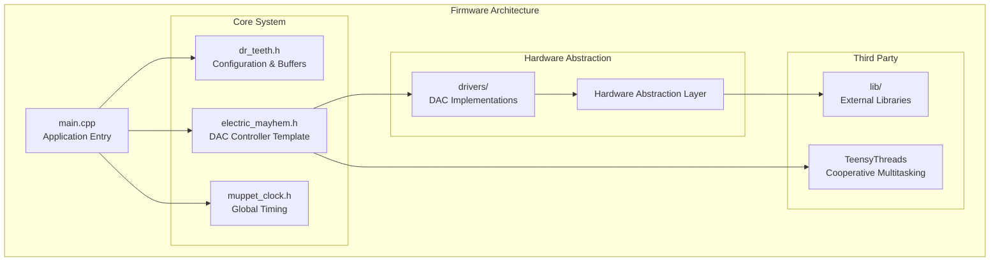
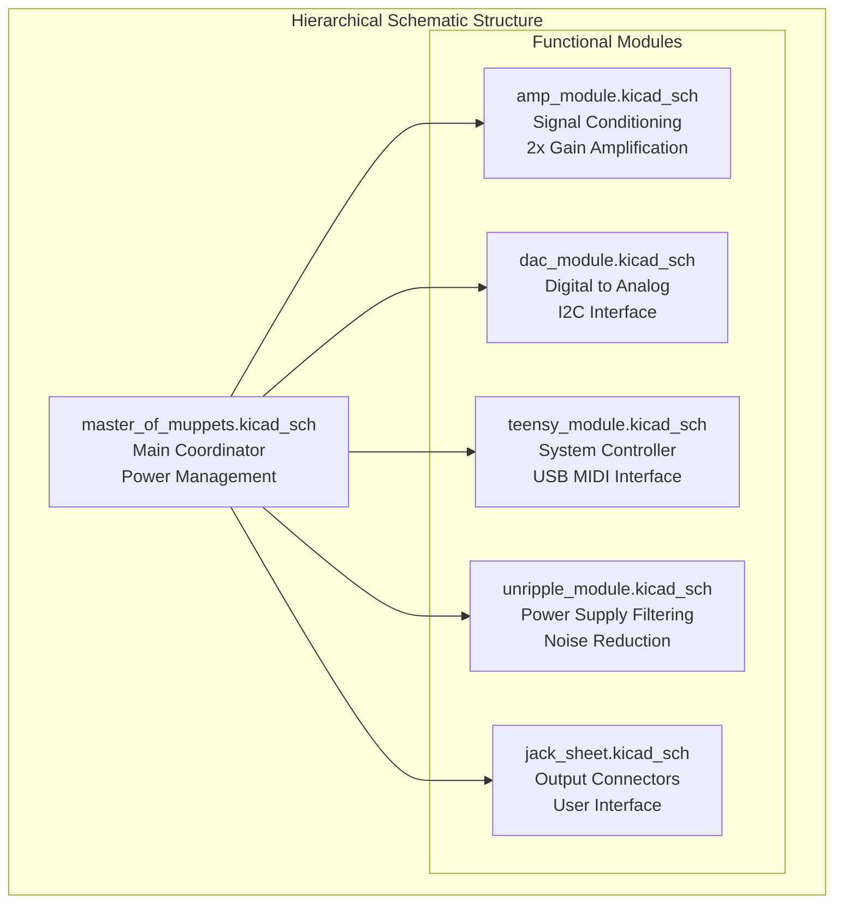
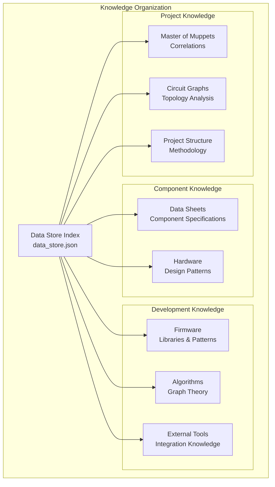
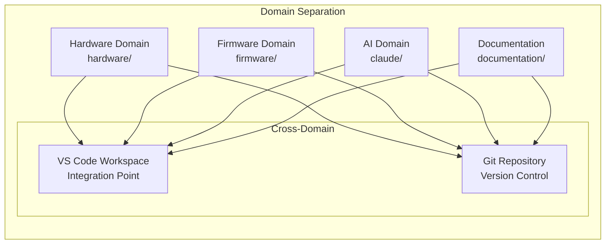
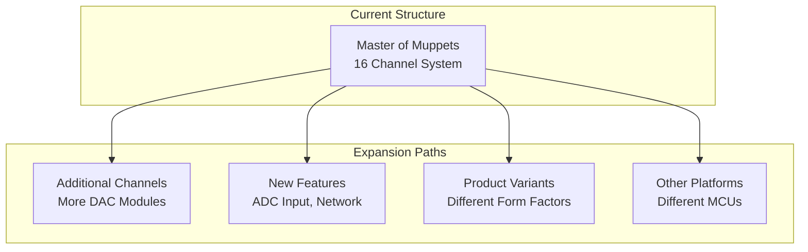

# Project Structure

## Overview

The Master of Muppets project employs a sophisticated multi-domain structure designed for AI-assisted collaborative development. The organization supports firmware development, hardware design, comprehensive knowledge management, and automated analysis tools within a unified workspace.

## Root Directory Organization

```
master_of_muppets aggregate/
├── documentation/              # Generated comprehensive documentation
├── firmware/                   # Teensy 4.1 embedded C++ firmware  
├── hardware/                   # KiCad schematic and PCB design files
├── claude/                     # AI knowledge management and tools
├── data_sheets/               # Component datasheets and specifications
├── CLAUDE.md                  # AI development protocols and instructions
├── README.md                  # Main project documentation
└── master_of_muppets aggregate.code-workspace  # VS Code workspace
```

## Firmware Structure (PlatformIO)

### Directory Layout

```
firmware/
├── platformio.ini              # PlatformIO project configuration
├── include/                    # Header files and public interfaces
│   ├── dr_teeth.h             # Core configuration and buffer management
│   ├── electric_mayhem.h      # Template-based multi-threaded DAC controller
│   ├── muppet_clock.h         # Global timing system interface
│   └── drivers/               # Hardware abstraction layer headers
│       ├── adafruit_mcp_4728.h
│       └── rob_tillaart_ad_5993r.h
├── src/                       # Implementation files
│   ├── main.cpp               # Main application entry point
│   ├── master_of_muppets.hpp  # Global buffer instantiation
│   ├── muppet_clock.cpp       # Timing system implementation
│   ├── drivers/               # Hardware driver implementations
│   │   ├── adafruit_mcp_4728.cpp
│   │   └── rob_tillaart_ad_5993r.cpp
│   └── name.c                 # Project metadata
├── lib/                       # Third-party libraries (included for hackability)
│   ├── AD5593R/               # Rob Tillaart's AD5593R library
│   ├── Adafruit BusIO/        # I2C/SPI abstraction layer
│   ├── Adafruit MCP4728/      # MCP4728 4-channel DAC library
│   ├── FunctionGenerator/     # Signal generation library
│   └── TeensyThreads/         # Cooperative multithreading library
└── test/                      # Unit tests and test framework
    └── README                 # Test documentation
```

### Code Organization Principles



### Naming Conventions

**Muppets-Themed Identifiers**:
- **dr_teeth**: Band leader - core configuration and constants
- **electric_mayhem**: The band - multi-threaded DAC controller
- **muppet_clock**: Global timing system
- **the_muppet_show**: Main data flow coordination thread
- **the_voice_from_beyond**: MIDI input processing thread
- **muppet_worker**: DAC hardware interface threads
- **party_pooper**: Periodic refresh and housekeeping thread

**Benefits of Thematic Naming**:
- Memorable and distinctive identifiers
- Clear functional associations
- Consistent throughout codebase
- Professional yet approachable

## Hardware Structure (KiCad)

### Project Organization

```
hardware/
├── master_of_muppets/          # Main USB MIDI to CV converter
│   ├── master_of_muppets.kicad_pro    # KiCad project file
│   ├── master_of_muppets.kicad_sch    # Main hierarchical schematic
│   ├── master_of_muppets.kicad_pcb    # PCB layout file
│   ├── master_of_muppets.kicad_sym    # Custom symbol library
│   ├── master_of_muppets.kicad_dru    # Design rule check settings
│   ├── fp-lib-table                   # Footprint library table
│   ├── sym-lib-table                  # Symbol library table
│   │
│   ├── hierarchical_schematics/       # Child sheets
│   │   ├── amp_module.kicad_sch       # Amplifier stage (35 components)
│   │   ├── dac_module.kicad_sch       # DAC interface (6 components)
│   │   ├── jack_sheet.kicad_sch       # Output connectors (16 components)
│   │   ├── teensy_module.kicad_sch    # Microcontroller (5 components)
│   │   └── unripple_module.kicad_sch  # Power filtering (3 components)
│   │
│   └── master_of_muppets-backups/     # Automatic timestamped backups
├── amplifier_board/            # Standalone amplifier design
├── teensy.pretty-master/       # Teensy footprint library
└── teensy_library-master/      # Teensy symbol library
```

### Hierarchical Design Philosophy



**Design Benefits**:
- **Modular Development**: Independent module design and testing
- **Maintainability**: Clear separation of concerns
- **Reusability**: Modules can be reused in other projects
- **Collaboration**: Multiple developers can work on different modules
- **Documentation**: Self-documenting hierarchical structure

## Claude AI System Structure

### Knowledge Management Architecture

```
claude/
├── contexts/                   # AI context configuration system
│   ├── base.json              # Context loading rules and auto-load configuration
│   ├── core.json              # Core behavioral rules and mandatory policies
│   ├── project.json           # Project-specific information and structure
│   ├── data_store.json        # Knowledge file index and access patterns
│   ├── coding_style.json      # Code formatting and style guidelines
│   └── git.json               # Git workflow and version control context
│
├── data_store/                # Structured knowledge repository
│   ├── knowledge/             # Organized knowledge files in JSON format
│   │   ├── algorithms/        # Graph theory and analysis algorithms
│   │   ├── coding/kicad/      # KiCad file format and parsing knowledge
│   │   ├── data_sheets/       # Component specifications and datasheets
│   │   ├── external_tools/    # Tool documentation and integration
│   │   ├── firmware/          # Firmware libraries and development patterns
│   │   ├── hardware/          # Hardware design knowledge and specifications
│   │   └── master_of_muppets/ # Project-specific organized knowledge
│   │       ├── correlations/  # Cross-domain relationship analysis
│   │       ├── graphs/        # Circuit topology and analysis
│   │       ├── project_structure/ # Development methodology
│   │       └── schematics/    # Enhanced schematic analysis
│   │
│   ├── pcb/                   # Parsed PCB project data
│   │   ├── master_of_muppets/ # Main project PCB analysis
│   │   └── amplifier_board/   # Amplifier PCB analysis
│   │
│   ├── schematics/            # Parsed schematic project data  
│   │   ├── master_of_muppets/ # Complete hierarchical analysis
│   │   └── amplifier_board/   # Amplifier schematic analysis
│   │
│   └── graphs/                # Circuit and code relationship graphs
│       └── master_of_muppets/ # Comprehensive graph analysis
│           └── hardware/      # Hardware topology graphs
│
├── tools/                     # Development and analysis tools
│   ├── kicad_json_converter.py        # Schematic to JSON converter
│   ├── kicad_pcb_json_converter.py    # PCB to JSON converter
│   ├── pcb_to_svg.py                  # PCB visualization tool
│   └── README_converter.md            # Tool documentation standards
│
└── tmp/                       # Temporary files and processing workspace
```

### Knowledge File Categories



### Context Loading System

**Automatic Loading Rules**:
```json
{
  "contexts": {
    "core": {
      "CRITICAL": true,
      "auto_load": "MANDATORY"
    },
    "project": {
      "CRITICAL": true,
      "auto_load": "MANDATORY"
    },
    "coding_style": {
      "auto_load": false,
      "keywords": ["create", "write", "implement", "edit"]
    }
  }
}
```

**Access Patterns**:
- **Component Lookup**: Automatic datasheet loading by part number
- **KiCad Analysis**: Context-aware parser selection  
- **Cross-Domain Queries**: Multi-knowledge file correlation
- **Tool Integration**: Automatic knowledge creation for new tools

## VS Code Workspace Configuration

### Multi-Folder Workspace

```json
{
  "folders": [
    {
      "name": "Master of Muppets Aggregate",
      "path": "."
    },
    {
      "name": "Firmware",
      "path": "./firmware"
    }
  ],
  "settings": {
    "platformio-ide.defaultProjectDir": "./firmware",
    "files.associations": {
      "*.kicad_sch": "lisp",
      "*.kicad_pcb": "lisp"
    }
  },
  "extensions": {
    "recommendations": [
      "platformio.platformio-ide",
      "ms-vscode.cpptools",
      "ms-python.python"
    ]
  }
}
```

### Development Environment Integration

**Supported Workflows**:
- **PlatformIO**: Embedded development with Teensy platform
- **KiCad**: Electrical design with integrated library management
- **Python**: Analysis tools and knowledge management
- **Git**: Version control with selective tracking
- **AI Assistant**: Claude integration for development assistance

## File Organization Principles

### Naming Conventions

**Directory Names**: snake_case for consistency
```
firmware/            ✅ Clear, lowercase
hardware/           ✅ Descriptive
claude/             ✅ AI system identifier
data_sheets/        ✅ Compound word with underscore
```

**File Names**: Context-appropriate conventions
```
# KiCad Files
master_of_muppets.kicad_sch     ✅ Project prefix + standard extension
amp_module.kicad_sch            ✅ Module name + extension

# Source Code  
dr_teeth.h                      ✅ Thematic naming
electric_mayhem.h               ✅ Consistent theme
muppet_clock.cpp                ✅ Clear function

# Knowledge Files
ad5593r.json                    ✅ Component part number
master_of_muppets_firmware.json ✅ Descriptive with project prefix
```

### Separation of Concerns



**Benefits**:
- **Independent Development**: Each domain can evolve independently
- **Clear Boundaries**: No accidental cross-domain dependencies
- **Tool Optimization**: Each domain uses optimal tools
- **Collaboration**: Multiple specialists can work simultaneously

### Backup and Version Control Strategy

**Git Tracking Strategy**:
```gitignore
# Include in version control
firmware/src/
firmware/include/
firmware/platformio.ini
hardware/*.kicad_pro
hardware/*.kicad_sch
hardware/*.kicad_pcb
claude/contexts/
claude/data_store/knowledge/
claude/tools/
documentation/

# Exclude from version control
hardware/*-backups/        # KiCad automatic backups
firmware/.pio/             # PlatformIO build artifacts
claude/tmp/                # Temporary processing files
*.bak                      # Generic backup files
```

**Backup Philosophy**:
- **KiCad Backups**: Automatic timestamped backups for design history
- **Git History**: Complete development history with meaningful commits
- **Knowledge Versioning**: AI knowledge files tracked for evolution
- **Build Artifacts**: Excluded to keep repository clean

## Scalability and Maintainability

### Modular Expansion

**Design for Growth**:


**Structural Support**:
- **Template Architecture**: Easy hardware abstraction changes
- **Hierarchical Design**: Modular hardware expansion
- **Knowledge Framework**: Systematic documentation of changes
- **Tool Ecosystem**: Automated analysis for new configurations

### Long-term Maintenance

**Sustainability Features**:
- **Comprehensive Documentation**: Self-explanatory structure
- **Standard Tools**: No proprietary dependencies
- **Open Source**: Community can maintain and enhance
- **AI-Assisted**: Automated analysis reduces manual maintenance
- **Version Control**: Complete history enables rollbacks and analysis

---

*This project structure demonstrates a new paradigm in embedded systems development, integrating hardware design, firmware development, AI assistance, and comprehensive knowledge management within a unified, scalable framework.*