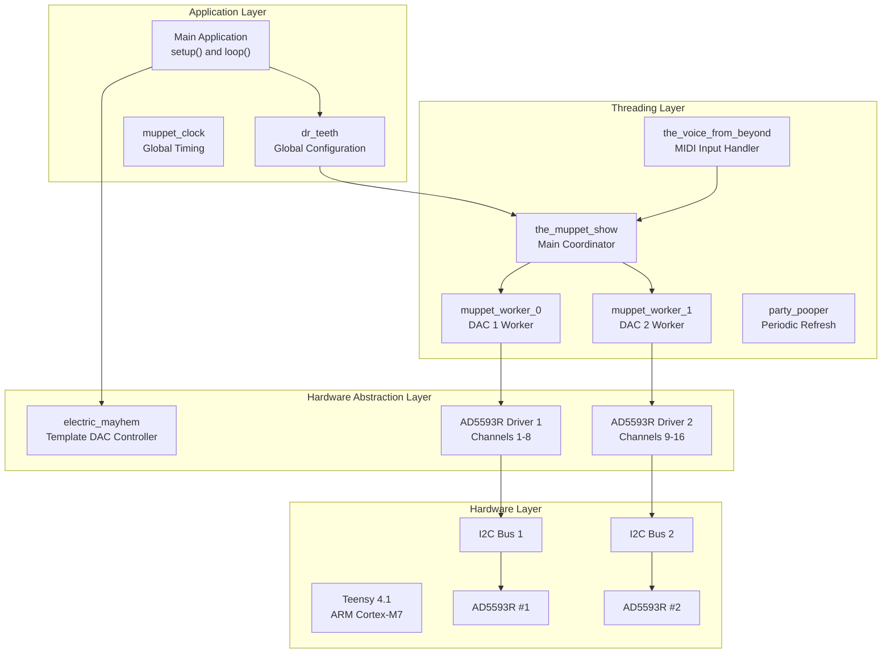
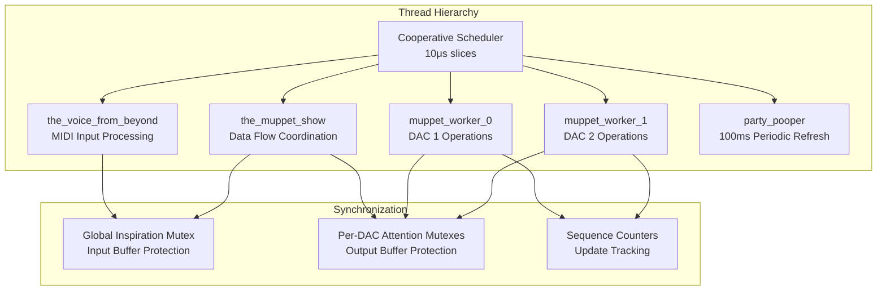
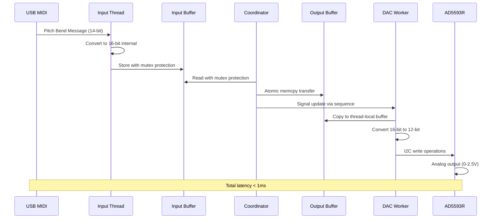
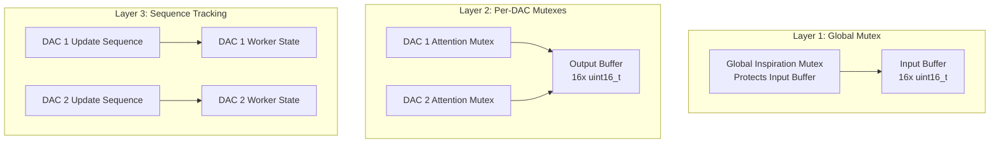

# Firmware Architecture

## Overview

The Master of Muppets firmware is a sophisticated real-time embedded system built on Teensy 4.1 (ARM Cortex-M7 @ 600MHz). It employs advanced multi-threading architecture with template-based hardware abstraction, achieving sub-millisecond MIDI-to-CV conversion latency.

## System Architecture



## Threading Architecture

### Cooperative Multitasking System

The firmware uses TeensyThreads library for cooperative multitasking with 10μs thread slices:



### Thread Responsibilities

#### 1. the_voice_from_beyond (MIDI Input)

**Purpose**: USB MIDI message processing and global timing
**Frequency**: Continuous with voluntary yield

```cpp
void the_voice_from_beyond() {
    while (1) {
        // Process USB MIDI messages
        usbMIDI.read();
        
        // Update global timing system
        muppet_clock::tick();
        
        // Test mode LFO generation (if enabled)
        #ifdef DENTAL_CHECK
        generate_lfo_signals();
        #endif
        
        threads.yield();
    }
}
```

**Synchronization**: Uses global inspiration mutex for thread-safe buffer updates

#### 2. the_muppet_show (Main Coordinator)

**Purpose**: Core data flow from input to output buffers
**Operation**: Atomic memory copy with mutex protection

```cpp
void the_muppet_show() {
    while (1) {
        global_inspiration.lock();
        
        // Copy input buffer to output buffer for each DAC
        for (int dac = 0; dac < dr_teeth::k_dac_count; dac++) {
            memcpy(&output_buffer[dac * channels_per_dac],
                   &input_buffer[dac * channels_per_dac],
                   channels_per_dac * sizeof(uint16_t));
        }
        
        global_inspiration.unlock();
        threads.yield();
    }
}
```

#### 3. muppet_worker Threads (DAC Operations)

**Purpose**: Hardware DAC interface with sequence-based updates
**Count**: 2 threads (one per DAC)

```cpp
template<int dac_index>
void muppet_worker() {
    while (1) {
        muppet_state& state = worker_states[dac_index];
        
        // Check if update is needed (sequence-based)
        state.state_mutex.lock();
        uint32_t current_seq = state.update_sequence;
        bool needs_update = (current_seq != last_processed_sequence[dac_index]);
        state.state_mutex.unlock();
        
        if (needs_update) {
            // Copy output buffer to thread-local buffer
            uint16_t local_buffer[8];
            memcpy(local_buffer, &output_buffer[dac_index * 8], 8 * sizeof(uint16_t));
            
            // Perform DAC hardware operations
            dac_drivers[dac_index].set_values(local_buffer);
            
            // Update processed sequence
            last_processed_sequence[dac_index] = current_seq;
        }
        
        threads.yield();
    }
}
```

#### 4. party_pooper (Periodic Refresh)

**Purpose**: System reliability and stuck state prevention
**Frequency**: Every 100ms

```cpp
void party_pooper() {
    while (1) {
        threads.delay(dr_teeth::k_force_refresh_every_millis);
        
        // Force update all DACs to prevent stuck states
        electric_mayhem_instance.shit_storm();
    }
}
```

## Data Flow Architecture

### Signal Processing Pipeline



### Buffer Management

**Input Buffer**: MIDI-derived values (16-bit resolution)
```cpp
volatile uint16_t input_buffer[dr_teeth::k_total_channels];  // 16 channels
```

**Output Buffer**: DAC-ready values (12-bit in 16-bit containers)
```cpp
volatile uint16_t output_buffer[dr_teeth::k_total_channels]; // 16 channels
```

**Thread Safety**: Double mutex protection
- Global inspiration mutex protects input buffer
- Per-DAC attention mutexes protect output buffer sections

## Hardware Abstraction Layer

### Template-Based DAC Interface

The system uses compile-time polymorphism for DAC driver abstraction:

```cpp
template<typename dac_driver_t>
class electric_mayhem {
private:
    dac_driver_t dac_drivers[dr_teeth::k_dac_count];
    
public:
    void initialize() {
        for (int i = 0; i < dr_teeth::k_dac_count; i++) {
            dac_drivers[i].initialize();
            dac_drivers[i].enable();
        }
    }
    
    void throw_muppet_in_the_mud(int dac_index) {
        // Request DAC update via sequence increment
        worker_states[dac_index].state_mutex.lock();
        worker_states[dac_index].update_sequence++;
        worker_states[dac_index].update_requested = true;
        worker_states[dac_index].state_mutex.unlock();
    }
};
```

### DAC Driver Requirements

Each DAC driver must implement:

```cpp
struct dac_driver_interface {
    using value_t = uint16_t;
    static constexpr int k_channels = 8;
    static constexpr uint16_t k_max_val = 4095;  // 12-bit
    
    bool initialize();
    void enable();
    void disable();
    void set_channel_value(int channel, value_t value);
    void set_values(value_t* values);
};
```

### Current Implementations

#### AD5593R Driver
- **Channels**: 8 configurable DAC/ADC (all configured as DAC)
- **Resolution**: 12-bit (4096 levels)
- **Interface**: I2C up to 400kHz
- **Special Features**: Internal 2.5V reference, 2x gain mode

#### MCP4728 Driver (Alternative)
- **Channels**: 4 with EEPROM storage
- **Resolution**: 12-bit (4096 levels)
- **Interface**: I2C with fast write support
- **Special Features**: Non-volatile settings, LDAC pin control

## Synchronization Architecture

### Three-Layer Protection



### Sequence-Based Updates

Prevents redundant DAC writes and ensures atomic updates:

```cpp
struct muppet_state {
    volatile bool update_requested;
    volatile bool update_in_progress;
    volatile uint32_t update_sequence;  // Monotonic counter
    Threads::Mutex state_mutex;
};
```

## Performance Optimizations

### Compiler Optimizations

**Build Flags**:
- `-O3`: Maximum optimization level
- `-ffast-math`: Aggressive floating-point optimizations
- `-funroll-loops`: Loop unrolling for performance
- `-fomit-frame-pointer`: Eliminate frame pointer overhead
- `-march=armv7e-m`: ARM Cortex-M7 specific optimizations
- `-mfpu=fpv4-sp-d16`: Hardware FPU utilization
- `-DARM_MATH_CM7`: ARM math library optimizations

### Memory Architecture

**Zero Dynamic Allocation**: All memory statically allocated at compile time
```cpp
// Static buffer allocation
volatile uint16_t input_buffer[16];
volatile uint16_t output_buffer[16];

// Static thread states
muppet_state worker_states[2];
```

**Efficient Data Transfer**: Direct memory copies with `memcpy()`
```cpp
memcpy(&output_buffer[dac_index * 8], 
       &input_buffer[dac_index * 8], 
       8 * sizeof(uint16_t));
```

## Real-Time Characteristics

### Latency Analysis

| Stage | Time | Description |
|-------|------|-------------|
| **USB MIDI** | <50μs | USB stack + parsing |
| **Buffer Copy** | <5μs | memcpy operation |
| **I2C Transaction** | ~20μs | 400kHz I2C write |
| **DAC Settling** | 6μs | AD5593R settling time |
| **Total System** | <100μs | Complete MIDI→CV chain |

### Thread Scheduling

```mermaid
gantt
    title Thread Execution Timeline (100μs window)
    dateFormat X
    axisFormat %s
    
    section Input Thread
    MIDI Processing    :0, 10
    Yield              :10, 20
    
    section Coordinator
    Buffer Copy        :20, 25
    Yield              :25, 30
    
    section DAC Worker 1
    I2C Transaction    :30, 50
    Yield              :50, 60
    
    section DAC Worker 2
    I2C Transaction    :60, 80
    Yield              :80, 90
    
    section Periodic
    Housekeeping       :90, 100
```



## Error Handling and Reliability

### Hardware Initialization

**Retry Logic**: Up to 100 attempts with 10ms delays
```cpp
bool initialize_dac(int dac_index) {
    for (int attempt = 0; attempt < 100; attempt++) {
        if (dac_drivers[dac_index].initialize()) {
            return true;  // Success
        }
        delay(10);  // 10ms retry delay
    }
    return false;  // Failed after all attempts
}
```

### Graceful Degradation

- System continues operation if individual DAC fails
- Failed channels default to 0V output
- Diagnostic LED indicates system status

### Periodic Refresh

**Stuck State Prevention**: 100ms force refresh of all DACs
```cpp
void shit_storm() {
    for (int dac = 0; dac < dr_teeth::k_dac_count; dac++) {
        throw_muppet_in_the_mud(dac);  // Force update
    }
}
```

## Testing and Debugging

### Compile-Time Test Modes

**DENTAL_CHECK**: Enables comprehensive test mode
```cpp
#ifdef DENTAL_CHECK
#define LFO_FREQUENCY 50    // 5.0 Hz LFO
#define LFO_SHAPE FG_TRIANGLE
#define DEBUG_LED 1
#endif
```

### Runtime Debugging Features

**LED Diagnostics**: Visual feedback for system status
- LED intensity reflects channel value
- LED blinking indicates activity
- Specific channel monitoring capability

### LFO Test Signal Generation

**Waveform Types**: sinus, triangle, square, sawtooth, trapezium, heartBeat
**Frequency Range**: 1-10000 Hz configurable
**Single Channel Mode**: Focus testing on specific channels

## Configuration Management

### Hardware Configuration

```cpp
struct dac_config {
    int i2c_bus;        // Wire, Wire1, Wire2
    int control_pin;    // Chip select pin
    int address;        // I2C address
};

// DAC 1: Wire2, Pin 11, Address 0x10
// DAC 2: Wire1, Pin 37, Address 0x11
```

### Runtime Parameters

```cpp
namespace dr_teeth {
    constexpr int k_dac_count = 2;
    constexpr int k_channels_per_dac = 8;
    constexpr int k_total_channels = 16;
    constexpr int k_thread_slice_micros = 10;
    constexpr int k_force_refresh_every_millis = 100;
}
```

## Production Deployment

### Build and Upload

```bash
# Build firmware
platformio run

# Upload to Teensy
platformio run --target upload

# Monitor serial output
platformio device monitor
```

### Quality Assurance

- **Static Analysis**: Comprehensive code review
- **Runtime Testing**: LFO mode validation
- **Hardware Testing**: Multi-DAC verification
- **Performance Testing**: Latency measurement
- **Reliability Testing**: Extended operation validation

---

*This firmware architecture achieves production-grade real-time performance through advanced threading, comprehensive synchronization, and extensive optimization for the Teensy 4.1 platform.*