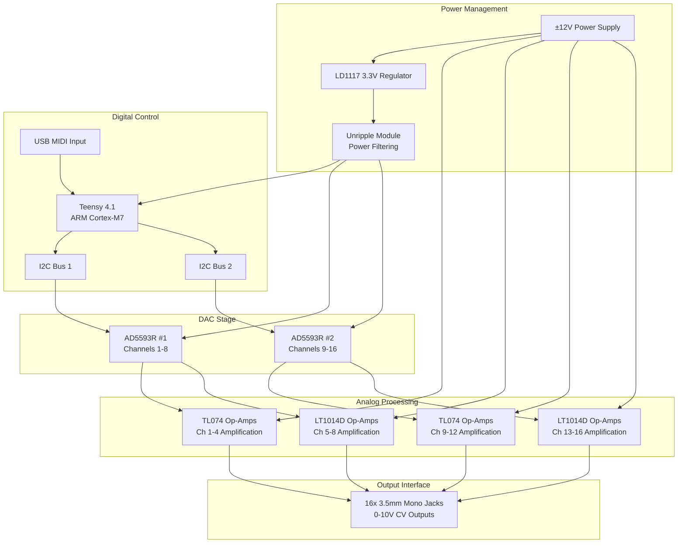
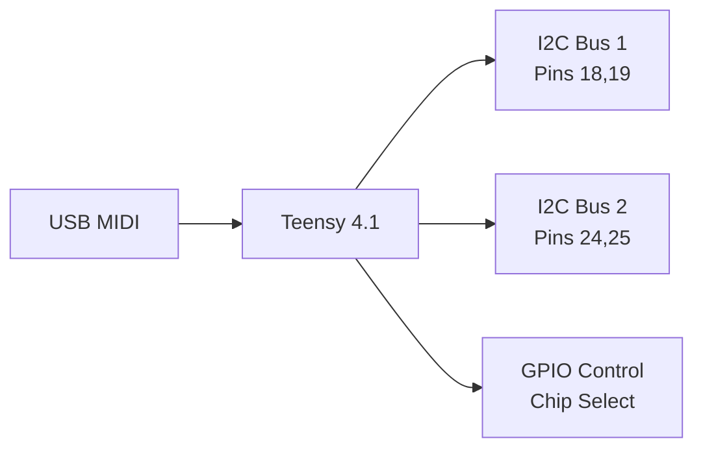
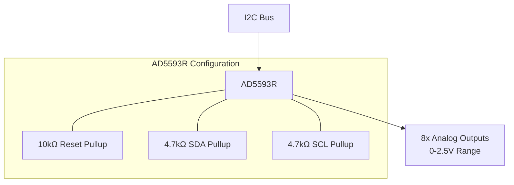
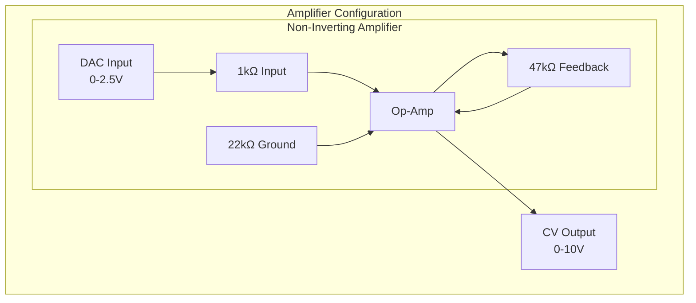
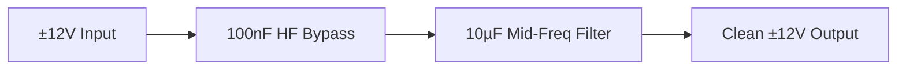
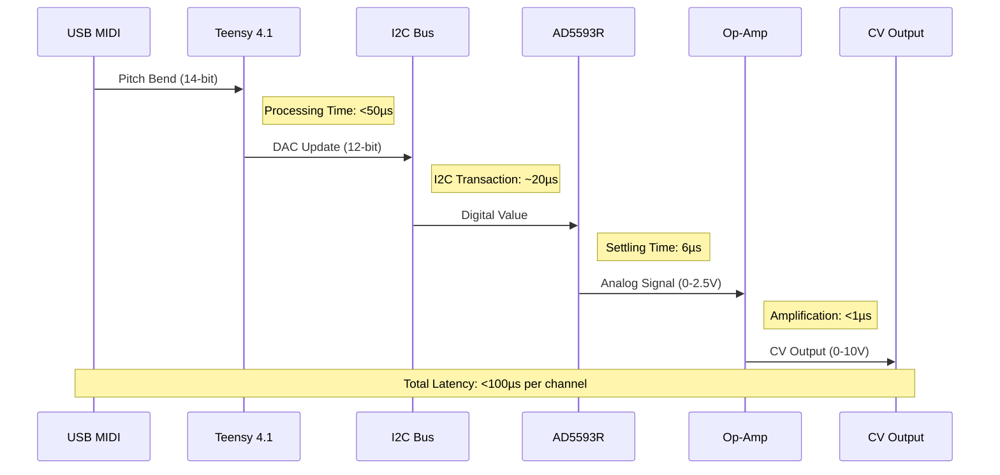
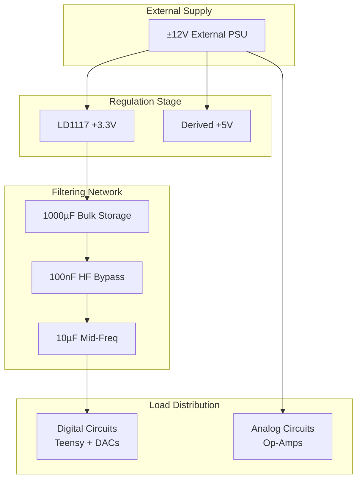

# Hardware Architecture

## Overview

The Master of Muppets hardware architecture employs a hierarchical modular design with 6 distinct modules totaling 77 components across 46 nets. The system is optimized for precision analog performance with real-time digital control.

## System Block Diagram

## Module Breakdown

### 1. Main Coordinator Module (12 components, 15 nets)

**Function**: System-level power management and hierarchical coordination

**Key Components**:
- **LD1117 (U1)**: 3.3V voltage regulator for digital circuits
- **1000µF Capacitor (C1)**: Bulk power filtering for stability
- **100nF Capacitor (C2)**: High-frequency decoupling

**Design Features**:
- Central power distribution hub
- Hierarchical sheet instance coordination
- System-level power symbols and references

### 2. Teensy Module (5 components, 3 nets)

**Function**: Main system controller and USB MIDI interface

**Key Specifications**:
- **Processor**: ARM Cortex-M7 @ 600MHz
- **Memory**: 1MB RAM, 8MB Flash, TCM
- **USB**: Native high-speed MIDI class compliant
- **I2C**: 3 independent buses available
- **Real-time**: Hardware FPU, deterministic timing

### 3. DAC Module (6 components, 6 nets)

**Function**: Digital to analog conversion with I2C interface

**Technical Specifications**:
- **Resolution**: 12-bit (4096 levels)
- **Channels**: 8 configurable DAC/ADC per chip
- **Interface**: I2C up to 400kHz (1MHz capable)
- **Reference**: Internal 2.5V or external
- **Settling Time**: 6µs to 0.1% accuracy
- **Address Selection**: Chip select pin controlled

### 4. Amplifier Module (35 components, 20 nets)

**Function**: Precision 2x gain amplification from 0-2.5V to 0-10V

**Key Components**:
- **TL074**: Quad JFET op-amp for general-purpose applications
- **LT1014D**: Precision quad op-amp (25µV offset, 0.6µV/°C drift)
- **Precision Resistors**: 1% tolerance for accurate gain setting
- **Decoupling Capacitors**: Power supply noise rejection

**Performance Characteristics**:
- **Gain**: 2x non-inverting configuration
- **Input Range**: 0-2.5V from DAC
- **Output Range**: 0-10V CV standard
- **Bandwidth**: DC to audio frequencies
- **Noise**: Optimized for professional audio applications

### 5. Unripple Module (3 components, 2 nets)

**Function**: Multi-stage power supply filtering

**Filtering Performance**:
- **Frequency Range**: 100Hz to 10MHz
- **Ripple Suppression**: >40dB at switching frequencies
- **Transient Response**: Fast settling, low impedance
- **Applications**: Analog/digital isolation, noise reduction

### 6. Jack Sheet (16 components, 0 nets)

**Function**: CV output connectors and user interface

**Connector Specifications**:
- **Type**: 3.5mm mono switched (Amphenol compatible)
- **Mounting**: Panel mount with threaded bushing
- **Current Rating**: 1A continuous
- **Voltage Rating**: 30V DC maximum
- **Spacing**: Eurorack compatible layout

## Signal Path Analysis

### Complete Signal Chain

### Critical Path Analysis

1. **USB MIDI Processing**: <50µs (USB stack + parsing)
2. **I2C Communication**: ~20µs per DAC update
3. **DAC Settling**: 6µs to 0.1% accuracy
4. **Op-Amp Response**: <1µs slew rate limited
5. **Total System Latency**: <100µs per channel

## Power Distribution

### Power Requirements

| Rail | Voltage | Current | Application |
|------|---------|---------|-------------|
| **+12V** | +12V ±5% | 200mA | Op-amp positive supply |
| **-12V** | -12V ±5% | 200mA | Op-amp negative supply |
| **+3.3V** | +3.3V ±5% | 500mA | Digital logic (Teensy, DACs) |
| **+5V** | +5V ±5% | 50mA | DAC analog supply |

### Power Distribution Network

## Thermal Considerations

### Heat Dissipation Analysis

| Component | Power Dissipation | Thermal Management |
|-----------|------------------|-------------------|
| **Teensy 4.1** | ~500mW @ 600MHz | Built-in thermal pad |
| **LD1117** | ~1W @ 500mA load | Heat sink recommended |
| **AD5593R** | <50mW per chip | Standard IC cooling |
| **Op-Amps** | <100mW per quad | Standard IC cooling |

### Thermal Design Guidelines

1. **Component Placement**: Separate high-power components
2. **Airflow**: Natural convection or forced air cooling
3. **Heat Sinks**: LD1117 regulator requires thermal management
4. **PCB Layout**: Thermal vias for heat spreading

## EMC and Signal Integrity

### Design Considerations

1. **Ground Plane**: Continuous ground plane for noise reduction
2. **Power Supply Decoupling**: Local bypass capacitors at each IC
3. **I2C Signal Integrity**: Controlled impedance, matched trace lengths
4. **Analog/Digital Separation**: Physical and electrical isolation
5. **Shielding**: Enclosure considerations for professional audio

### Critical Design Rules

- **Trace Width**: Minimum 0.2mm for signals, 0.5mm for power
- **Via Stitching**: Ground plane continuity across layers
- **Component Placement**: Critical analog components away from switchers
- **Clock Distribution**: Minimize high-frequency signal coupling

## Manufacturing Considerations

### PCB Specifications

- **Layer Count**: 4-layer recommended (signal/ground/power/signal)
- **Board Thickness**: 1.6mm standard
- **Material**: FR4 standard, Rogers for high-frequency if needed
- **Surface Finish**: HASL or ENIG for reliability

### Assembly Requirements

- **SMD Components**: Majority surface mount for automated assembly
- **Through-hole**: Connectors and large capacitors only
- **Test Points**: Accessible for in-circuit testing and debugging
- **Programming Interface**: Teensy USB connector accessible

### Quality Control

- **Electrical Test**: In-circuit test for all nets and components
- **Functional Test**: MIDI input to CV output verification
- **Calibration**: Per-channel offset and gain adjustment if required
- **Burn-in**: Extended operation test for reliability

---

*This hardware architecture achieves production-ready performance through comprehensive analysis and optimization of all system components and interconnections.*