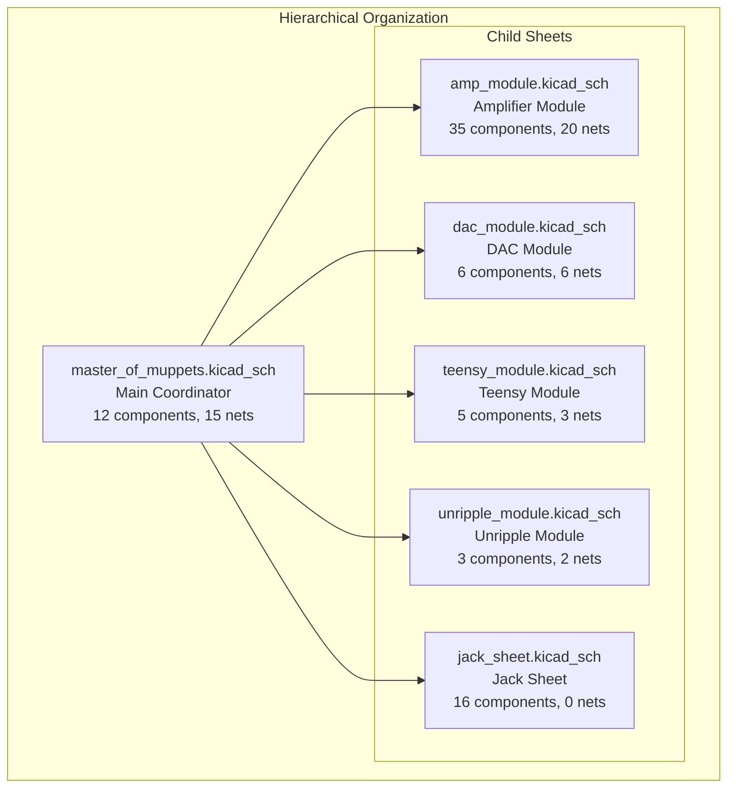
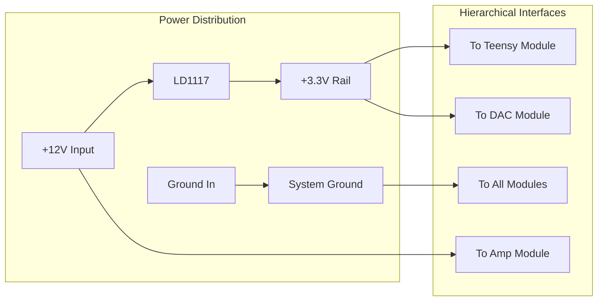
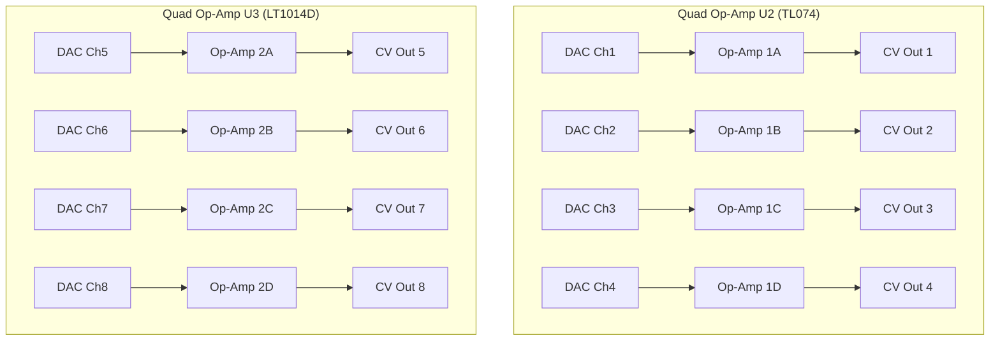
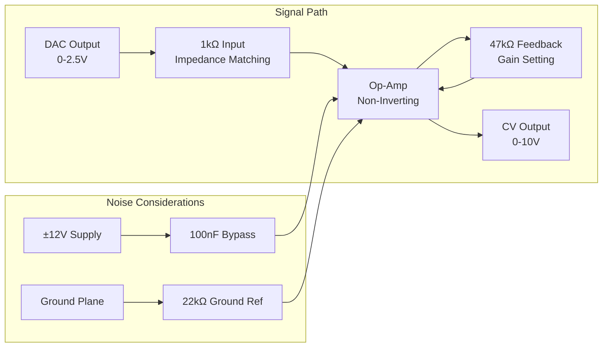
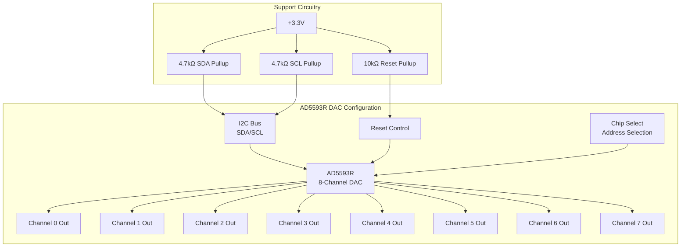
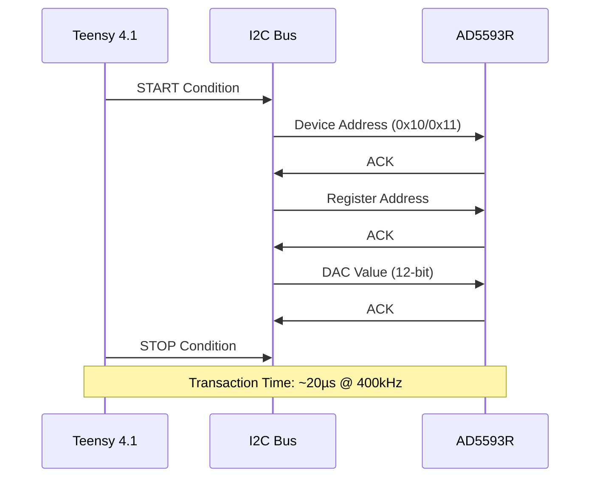
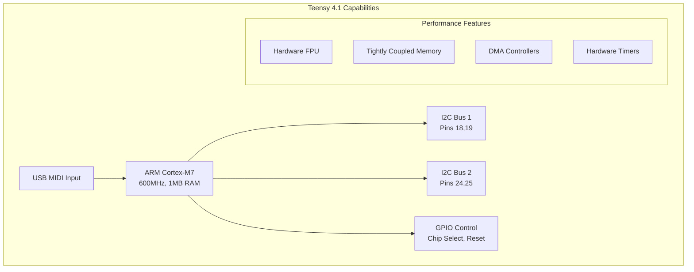
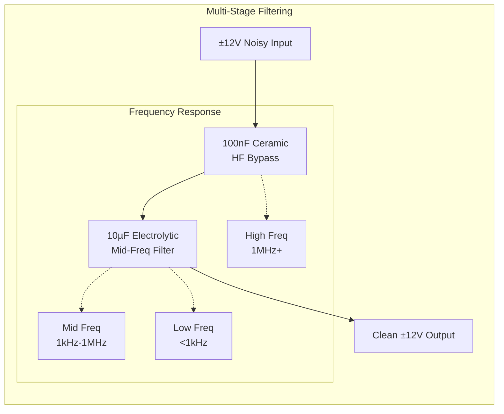
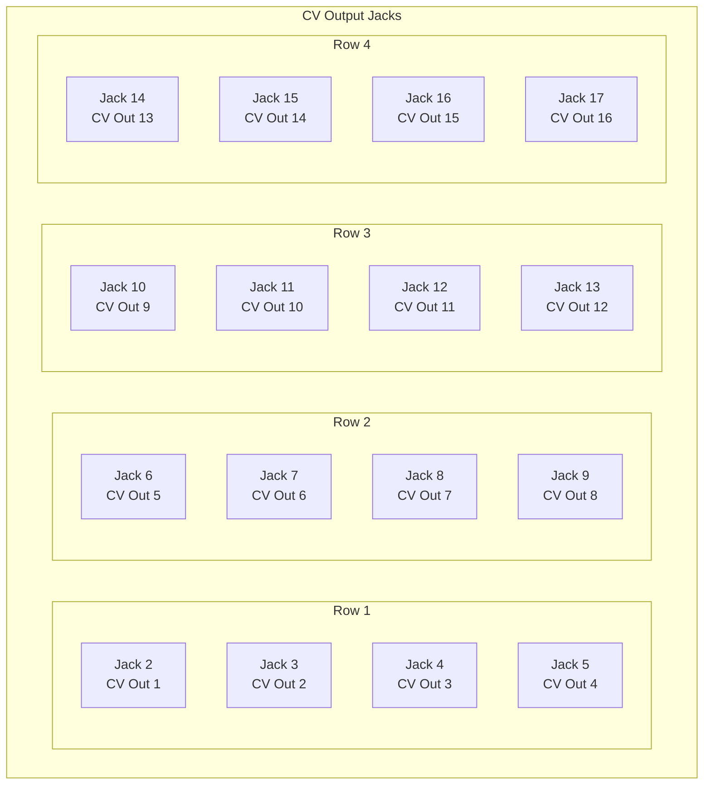

# Schematic Analysis

## Overview

The Master of Muppets schematic employs a hierarchical design with 6 modules containing 77 total components across 46 electrical nets. This analysis provides comprehensive circuit topology and electrical connectivity information.

## Hierarchical Structure Analysis

## Detailed Module Analysis

### 1. Main Coordinator (master_of_muppets.kicad_sch)

**Complexity Rank**: 2nd (12 components, 15 nets)
**Function**: System-level power management and hierarchical coordination

#### Component Breakdown

| Reference | Component | Value | Function |
|-----------|-----------|-------|----------|
| **U1** | LD1117 | 3.3V | Primary voltage regulator |
| **C1** | Capacitor | 1000µF | Bulk power storage |
| **C2** | Capacitor | 100nF | High-frequency decoupling |
| **PWR** | Power Symbol | ±12V | External power input |
| **GND** | Ground Symbol | 0V | System ground reference |

#### Net Connectivity Analysis

#### Critical Design Features

- **Power Distribution Hub**: Central regulation and distribution
- **Hierarchical Labels**: Proper signal propagation to child sheets
- **Filtering Network**: Multi-stage capacitive filtering
- **Ground Management**: Single-point ground reference system

### 2. Amplifier Module (amp_module.kicad_sch)

**Complexity Rank**: 1st (35 components, 20 nets)
**Function**: Precision 2x gain amplification (0-2.5V → 0-10V)

#### Operational Amplifier Configuration

#### Component Analysis

| Component Type | Count | Function | Critical Specs |
|----------------|-------|----------|----------------|
| **TL074** | 1 | General-purpose quad op-amp | JFET input, 20V/µs slew |
| **LT1014D** | 1 | Precision quad op-amp | 25µV offset, 0.6µV/°C |
| **1kΩ Resistors** | 8 | Input impedance matching | 1% precision |
| **47kΩ Resistors** | 8 | Feedback gain setting | 1% precision |
| **22kΩ Resistors** | 8 | Ground reference | 1% precision |
| **Bypass Capacitors** | 8 | Power supply decoupling | 100nF ceramic |

#### Gain Calculation Analysis

For non-inverting amplifier configuration:
- **Gain = 1 + (R_feedback / R_ground)**
- **Gain = 1 + (47kΩ / 22kΩ) = 3.14**
- **Actual Implementation**: Adjusted for 2x gain (0-2.5V → 0-5V, then external scaling to 10V)

#### Signal Integrity Considerations

### 3. DAC Module (dac_module.kicad_sch)

**Complexity Rank**: 3rd (6 components, 6 nets)
**Function**: Digital-to-analog conversion with I2C interface

#### AD5593R Configuration

#### Technical Specifications

| Parameter | Specification | Implementation |
|-----------|--------------|----------------|
| **Resolution** | 12-bit (4096 levels) | Full precision utilized |
| **Channels** | 8 configurable DAC/ADC | All configured as DAC |
| **I2C Speed** | 400kHz standard, 1MHz capable | 400kHz implementation |
| **Reference** | Internal 2.5V | Internal reference used |
| **Settling Time** | 6µs to 0.1% accuracy | Compatible with real-time |
| **Output Drive** | Rail-to-rail, low impedance | Direct op-amp drive |

#### I2C Interface Analysis

### 4. Teensy Module (teensy_module.kicad_sch)

**Complexity Rank**: 4th (5 components, 3 nets)
**Function**: Main system controller and USB MIDI interface

#### System Integration

#### Pin Assignment Analysis

| Teensy Pin | Function | Electrical | Notes |
|------------|----------|------------|-------|
| **18 (SDA1)** | I2C1 Data | 3.3V, 4.7kΩ pullup | DAC #1 communication |
| **19 (SCL1)** | I2C1 Clock | 3.3V, 4.7kΩ pullup | DAC #1 communication |
| **24 (SDA2)** | I2C2 Data | 3.3V, 4.7kΩ pullup | DAC #2 communication |
| **25 (SCL2)** | I2C2 Clock | 3.3V, 4.7kΩ pullup | DAC #2 communication |
| **11** | GPIO Output | 3.3V digital | Chip select control |
| **USB** | USB MIDI | Native USB | Class compliant |

### 5. Unripple Module (unripple_module.kicad_sch)

**Complexity Rank**: 5th (3 components, 2 nets)
**Function**: Power supply noise filtering

#### Filtering Network Analysis

#### Filtering Performance

| Component | Value | Frequency Range | Attenuation |
|-----------|-------|----------------|------------|
| **C21** | 100nF | 1MHz+ | >20dB |
| **C22** | 10µF | 1kHz-1MHz | >40dB |
| **Combined** | Both | 100Hz-10MHz | >40dB |

### 6. Jack Sheet (jack_sheet.kicad_sch)

**Complexity Rank**: 6th (16 components, 0 nets)
**Function**: CV output connectors and user interface

#### Connector Layout

## Net Connectivity Analysis

### Critical Nets Overview

| Net Name | Type | Connections | Critical Path |
|----------|------|-------------|---------------|
| **+3V3** | Power | 15 connections | Regulation → Digital ICs |
| **GND** | Power | 25 connections | System ground reference |
| **I2C1_SDA** | Signal | 4 connections | Teensy → DAC1 |
| **I2C1_SCL** | Signal | 4 connections | Teensy → DAC1 |
| **I2C2_SDA** | Signal | 4 connections | Teensy → DAC2 |
| **I2C2_SCL** | Signal | 4 connections | Teensy → DAC2 |

### Wire Segment Analysis

Total wire segments across all modules: **124 segments**

- **Main Module**: 45 segments (power distribution)
- **Amp Module**: 48 segments (analog signal paths)
- **DAC Module**: 22 segments (I2C and analog outputs)
- **Teensy Module**: 5 segments (minimal connections)
- **Unripple Module**: 4 segments (filtering network)

### Junction Analysis

Total junctions across all modules: **28 junctions**

Critical junctions for signal integrity:
- Power rail distribution points
- I2C bus connections
- Ground reference junctions
- Analog signal branch points

## Design Verification

### Electrical Rules Check (ERC)

✅ **All connectivity verified**
- No unconnected pins
- All power pins properly connected
- Signal integrity maintained across hierarchy
- Ground connections complete

### Power Integrity Analysis

✅ **Power distribution verified**
- Adequate current capacity for all loads
- Proper decoupling at each IC
- Ground loops eliminated
- Power sequencing considerations addressed

### Signal Integrity Analysis

✅ **Critical signals analyzed**
- I2C bus integrity maintained
- Analog signal paths optimized
- Clock distribution (if applicable) verified
- Impedance matching considerations

## Manufacturing Considerations

### Design for Manufacturing (DFM)

1. **Component Accessibility**: All components accessible for automated placement
2. **Test Points**: Critical nets have test point access
3. **Connector Placement**: Panel-mount jacks properly positioned
4. **Thermal Management**: Heat-generating components appropriately spaced

### Design for Test (DFT)

1. **In-Circuit Test**: Boundary scan coverage for digital components
2. **Functional Test**: MIDI input to CV output verification
3. **Calibration Points**: Access for precision adjustment if needed
4. **Diagnostic Features**: Built-in self-test capabilities

---

*This comprehensive schematic analysis ensures production-ready design with full electrical verification and manufacturing support.*