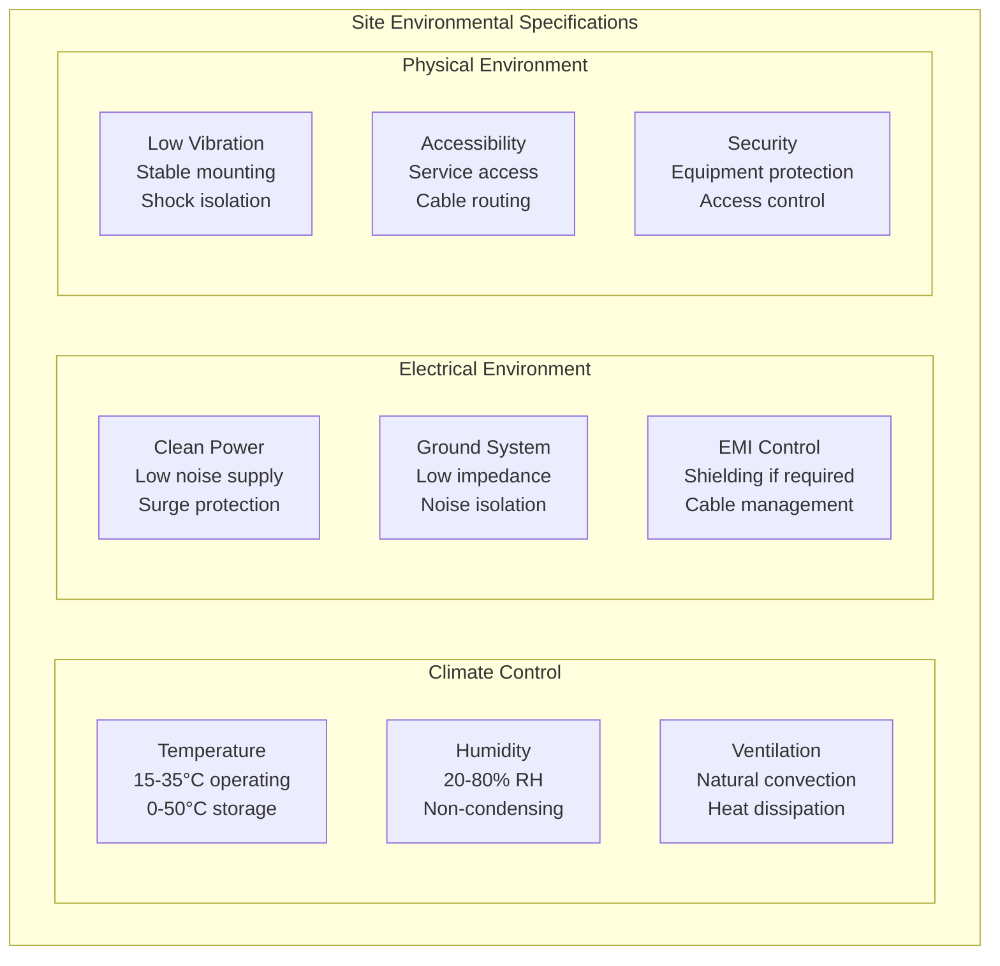
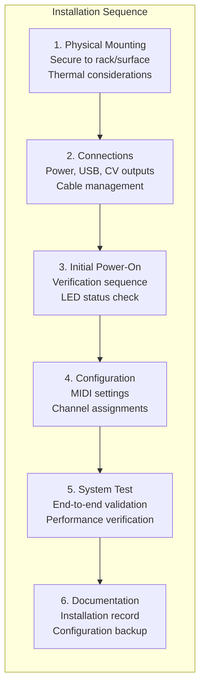
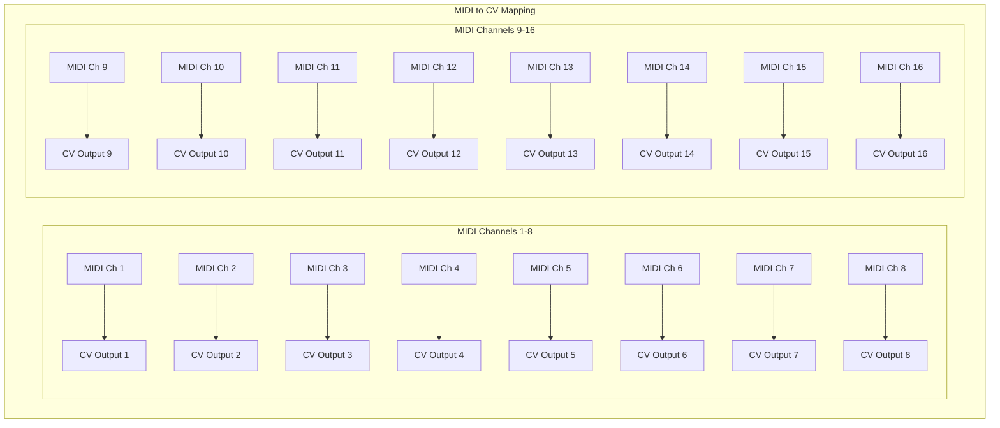
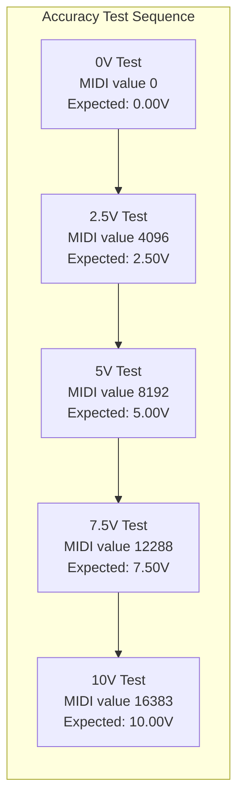
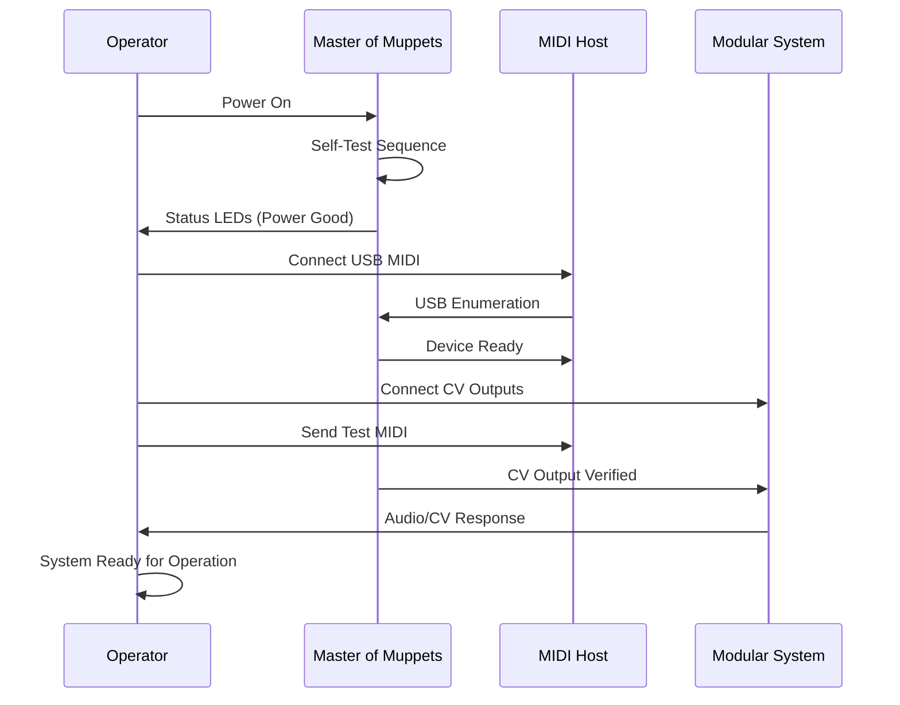
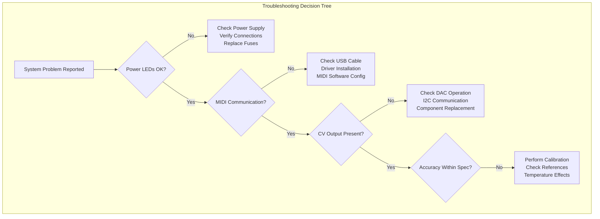

# Deployment Procedures

## Overview

This document provides comprehensive procedures for deploying Master of Muppets systems in production environments, including installation, configuration, testing, and maintenance protocols. These procedures ensure reliable operation in professional audio and modular synthesizer applications.

## Pre-Deployment Checklist

### System Verification

```mermaid
graph TB
    subgraph "Pre-Deployment Verification"
        subgraph "Hardware Inspection"
            VIS[Visual Inspection<br/>Component integrity]
            CONN[Connector Verification<br/>All connections secure]
            PWR[Power Supply Check<br/>±12V verification]
        end
        
        subgraph "Functional Testing"
            BOOT[Boot Test<br/>System initialization]
            MIDI[MIDI Communication<br/>USB connectivity]
            CV[CV Output Test<br/>All 16 channels]
        end
        
        subgraph "Performance Validation"
            LAT[Latency Test<br/><1ms verification]
            ACC[Accuracy Test<br/>±0.1% specification]
            TEMP[Temperature Test<br/>Operating range]
        end
        
        VIS --> CONN
        CONN --> PWR
        PWR --> BOOT
        BOOT --> MIDI
        MIDI --> CV
        CV --> LAT
        LAT --> ACC
        ACC --> TEMP
    end
```



### Required Equipment

**Installation Tools**:
- Digital multimeter (4.5 digit minimum)
- Oscilloscope (100MHz bandwidth minimum)  
- USB MIDI testing software
- ±12V DC power supply (2A capacity)
- 3.5mm test cables (16 minimum)
- Heat gun (for heat sink thermal compound)

**Test Equipment Specifications**:
- **DMM Accuracy**: ±0.1% DC voltage
- **Scope Bandwidth**: 100MHz (-3dB)
- **Scope Sample Rate**: 1GSa/s minimum
- **Power Supply Regulation**: ±1% line/load
- **Cable Impedance**: 50Ω for signal integrity

## Site Preparation

### Environmental Requirements



### Power System Requirements

**Primary Power Specifications**:
- **Input Voltage**: ±12V DC ±5%
- **Current Capacity**: 1A minimum (2A recommended)
- **Regulation**: ±1% line and load regulation
- **Ripple**: <50mV p-p @ 120Hz
- **Noise**: <10mV RMS broadband
- **Protection**: Overcurrent, overvoltage, reverse polarity

**Power Quality Verification**:
```bash
# Power quality test procedure
1. Measure DC voltage: 11.4V - 12.6V acceptable
2. Check ripple: <50mV p-p with scope
3. Load test: Full current draw for 1 hour
4. Temperature rise: <20°C above ambient
5. Protection test: Verify shutdown thresholds
```

## Installation Procedures

### Physical Installation



### Connection Procedures

**Step 1: Power Connection**
```bash
# Power connection checklist
□ Verify power supply polarity: +12V (red), GND (black), -12V (blue)
□ Check voltage at connector: ±12V ±0.6V acceptable
□ Measure current draw: <100mA at power-on
□ Verify LED indicators: Power LED solid, Status LED blinking
□ Temperature check: No excessive heat after 5 minutes
```

**Step 2: USB MIDI Connection**
```bash
# USB MIDI setup procedure
□ Connect USB cable to host computer
□ Verify device enumeration in OS
□ Test MIDI communication with test software
□ Confirm device appears as "Master of Muppets"
□ Send test MIDI messages and verify response
```

**Step 3: CV Output Connections**
```bash
# CV output verification
□ Connect oscilloscope to Channel 1 output
□ Send MIDI pitch bend message (CC value 0)
□ Verify 0V output ±10mV
□ Send MIDI pitch bend message (CC value 16383)
□ Verify 10V output ±50mV
□ Repeat for all 16 channels
□ Document any deviations from specification
```

### Configuration Management

**MIDI Configuration**:
- **MIDI Channel**: Channels 1-16 (configurable)
- **Control Change**: Pitch bend (default) or CC controllers
- **Response Curve**: Linear (default) or logarithmic
- **Update Rate**: 1000Hz maximum (USB limited)

**Channel Assignment Matrix**:


## System Commissioning

### Performance Verification Tests

**Test 1: Latency Measurement**
```bash
# Latency test procedure
Equipment: Oscilloscope with dual channel capability
1. Connect MIDI output trigger to scope channel 1
2. Connect CV output to scope channel 2
3. Send MIDI pitch bend change
4. Measure time between MIDI edge and CV change
5. Acceptable range: <1ms (target <100μs)
6. Record results for all 16 channels
```

**Test 2: Accuracy and Linearity**


**Test 3: Channel Isolation**
```bash
# Channel isolation test
Equipment: Two digital multimeters
1. Set channel 1 to 10V output
2. Set channel 2 to 0V output  
3. Measure crosstalk on channel 2
4. Acceptable: <10mV crosstalk
5. Repeat for all adjacent channel pairs
6. Test worst-case: all odd channels at 10V, all even at 0V
```

### Calibration Procedures

**Per-Channel Calibration**:
```python
# Calibration algorithm (pseudocode)
def calibrate_channel(channel_number):
    # Zero point calibration
    send_midi_value(0)
    measured_zero = measure_cv_output(channel_number)
    zero_offset = 0.000 - measured_zero
    
    # Full scale calibration  
    send_midi_value(16383)
    measured_full = measure_cv_output(channel_number)
    full_scale_error = 10.000 - measured_full
    
    # Calculate correction factors
    gain_correction = 10.000 / (measured_full - measured_zero)
    offset_correction = -measured_zero * gain_correction
    
    # Store calibration data
    store_calibration(channel_number, gain_correction, offset_correction)
    
    return validation_test(channel_number)
```

**Calibration Acceptance Criteria**:
- **Zero Offset**: <5mV after calibration
- **Full Scale Accuracy**: ±5mV at 10V output
- **Linearity**: <0.05% INL across full range
- **Temperature Drift**: <50ppm/°C over 0-50°C
- **Long-term Stability**: <0.01% over 24 hours

## Operational Procedures

### Daily Startup Sequence



**Startup Checklist**:
```bash
□ Visual inspection for damage
□ Power supply voltage verification
□ LED status indicators check
□ USB MIDI connection established
□ CV output continuity test
□ Basic functionality test (1 channel)
□ Full system test (all 16 channels)
□ Temperature stability check (5 minutes)
□ Documentation update (logbook entry)
```

### Performance Monitoring

**Continuous Monitoring Parameters**:
- **System Temperature**: Monitor LD1117 heat sink
- **Power Supply Voltages**: ±12V and +3.3V rails
- **USB MIDI Activity**: Connection status and data flow
- **CV Output Levels**: Spot checks during operation
- **Error Indicators**: Monitor for fault conditions

**Monitoring Intervals**:
- **Real-time**: Temperature, power, MIDI activity
- **Hourly**: CV output spot check (rotating channels)
- **Daily**: Complete functional verification
- **Weekly**: Full calibration verification
- **Monthly**: Comprehensive performance test

## Maintenance Procedures

### Preventive Maintenance Schedule

```mermaid
gantt
    title Preventive Maintenance Timeline
    dateFormat X
    axisFormat %s
    
    section Daily
    Visual Inspection    :0, 1
    Power Check         :1, 2
    
    section Weekly
    Calibration Check   :7, 8
    Connection Audit    :8, 9
    
    section Monthly
    Full Performance    :30, 32
    Documentation       :32, 33
    
    section Quarterly
    Deep Inspection     :90, 93
    Component Check     :93, 95
    
    section Annually
    Complete Overhaul   :365, 368
    Certification       :368, 370
```



### Routine Maintenance Tasks

**Daily Maintenance (5 minutes)**:
```bash
# Daily maintenance checklist
□ Visual inspection for damage or contamination
□ LED status indicator verification
□ Power supply voltage check (quick DMM reading)
□ Temperature assessment (thermal gun or hand test)
□ Cable and connector inspection
□ Logbook entry with date/time/operator
```

**Weekly Maintenance (15 minutes)**:
```bash
# Weekly maintenance procedure
□ Single-channel calibration verification
□ Connection torque check (if accessible)
□ Dust removal from heat sink and ventilation
□ USB connector cleaning (if needed)
□ CV output jack inspection and cleaning
□ Performance trend analysis from logs
```

**Monthly Maintenance (1 hour)**:
```bash
# Monthly comprehensive maintenance
□ Complete 16-channel calibration check
□ Full system performance test
□ Thermal imaging (if available)
□ Vibration and mechanical inspection
□ Power supply load test
□ Documentation update and archiving
□ Spare parts inventory check
```

### Troubleshooting Procedures

**Common Issues and Solutions**:



**Fault Isolation Matrix**:

| Symptom | Possible Cause | Test Procedure | Solution |
|---------|---------------|----------------|----------|
| **No Power** | Power supply failure | Check ±12V at input | Replace power supply |
| **No MIDI** | USB connection issue | Test with different cable | Replace USB cable |
| **No CV Output** | DAC failure | Check I2C communication | Replace AD5593R |
| **Inaccurate CV** | Reference drift | Measure internal reference | Recalibrate system |
| **High Noise** | Ground loop | Check ground connections | Improve grounding |
| **Thermal Shutdown** | Overheating | Check heat sink | Clean/replace heat sink |

### Component Replacement Procedures

**Field Replaceable Components**:
1. **Teensy 4.1**: Socket mounted for easy replacement
2. **LD1117 Regulator**: Through-hole for field service
3. **Electrolytic Capacitors**: Wear components, monitor ESR
4. **3.5mm Jacks**: Panel mount, accessible from front
5. **Heat Sink**: Thermal compound refresh every 2 years

**Component Replacement Protocol**:
```bash
# Component replacement procedure
1. Power down system and disconnect all cables
2. Document existing configuration and calibration
3. Remove failed component following ESD procedures
4. Install replacement component per assembly instructions
5. Power on and verify basic functionality
6. Perform complete calibration procedure
7. Run full performance verification test
8. Update maintenance records and part serial numbers
```

## Quality Control and Documentation

### Quality Metrics

**Key Performance Indicators**:
- **System Uptime**: >99.9% availability target
- **Calibration Drift**: <0.01% per month maximum
- **Mean Time Between Failures**: >10,000 hours
- **Mean Time To Repair**: <30 minutes
- **Customer Satisfaction**: >95% positive feedback

### Documentation Requirements

**Deployment Documentation Package**:
1. **Installation Record**: Date, location, configuration
2. **Commissioning Test Results**: All test data and signatures
3. **Calibration Certificate**: Factory and field calibration data
4. **Maintenance Log**: All maintenance activities and findings
5. **Performance Trend Data**: Historical performance tracking
6. **Configuration Backup**: System settings and customizations

**Record Retention**:
- **Performance Data**: 5 years minimum
- **Calibration Records**: Life of system + 2 years
- **Maintenance Logs**: Life of system + 2 years
- **Incident Reports**: 10 years minimum
- **Configuration Changes**: Complete revision history

### Training Requirements

**Operator Training**:
- **Basic Operation**: 2 hours classroom + hands-on
- **Daily Maintenance**: 1 hour practical training
- **Troubleshooting**: 4 hours including documentation

**Technician Training**:
- **Installation**: 8 hours including safety procedures
- **Calibration**: 4 hours precision measurement techniques
- **Repair**: 8 hours component-level troubleshooting
- **Advanced Maintenance**: 4 hours preventive procedures

**Training Certification**:
- Written examination (80% minimum score)
- Practical demonstration of procedures
- Annual recertification requirement
- Continuing education requirements

---

*These comprehensive deployment procedures ensure reliable, maintainable operation of Master of Muppets systems in professional environments with full documentation and quality assurance for long-term success.*