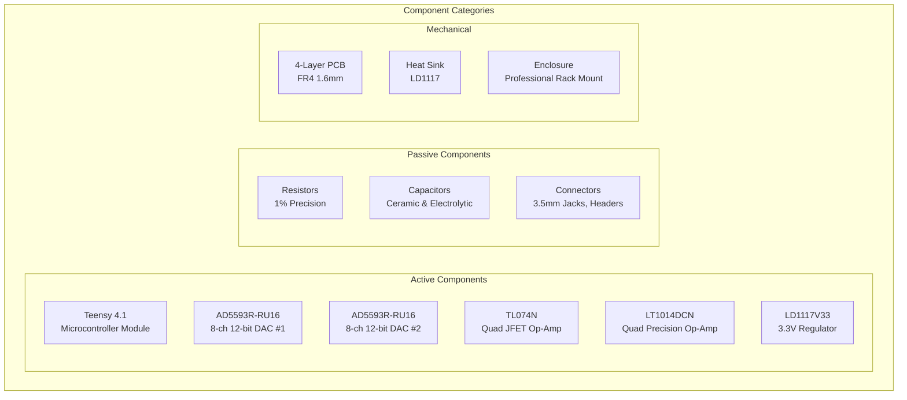
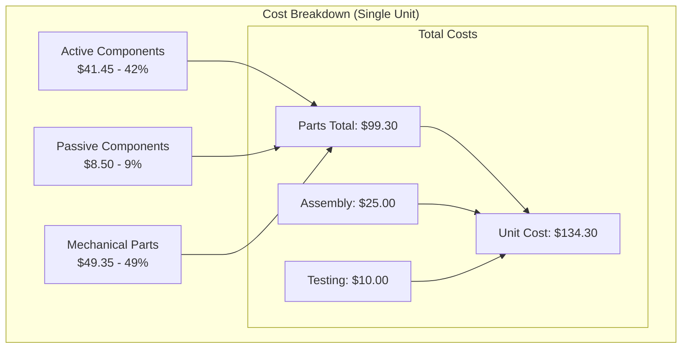
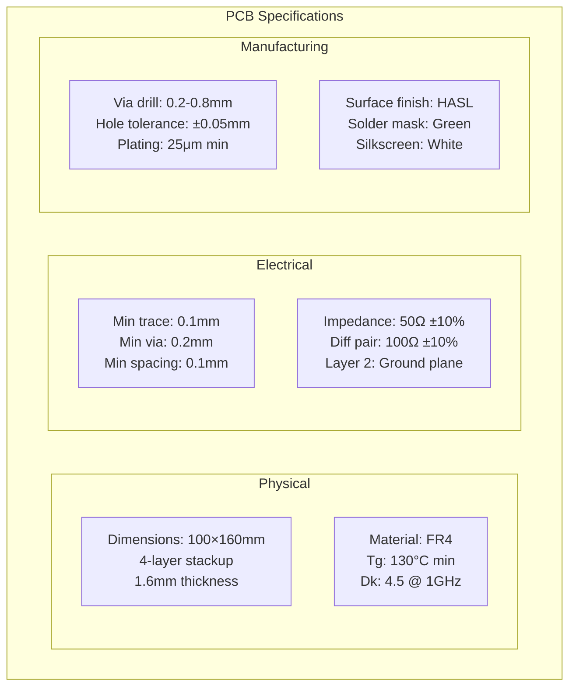
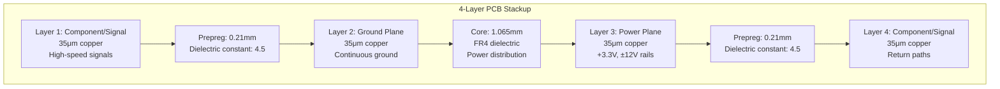
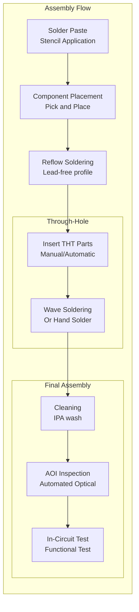
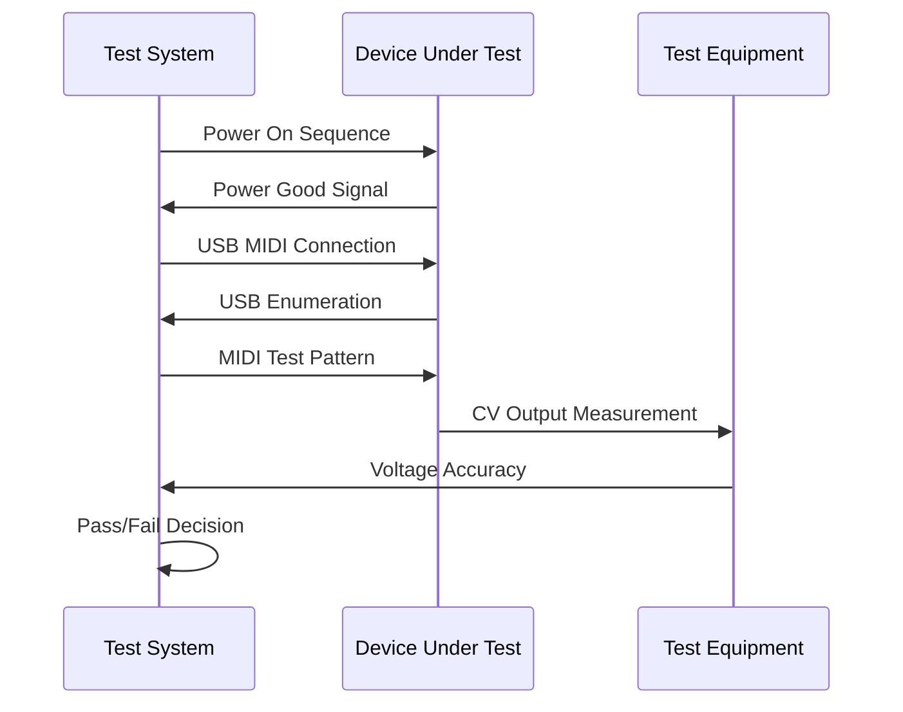
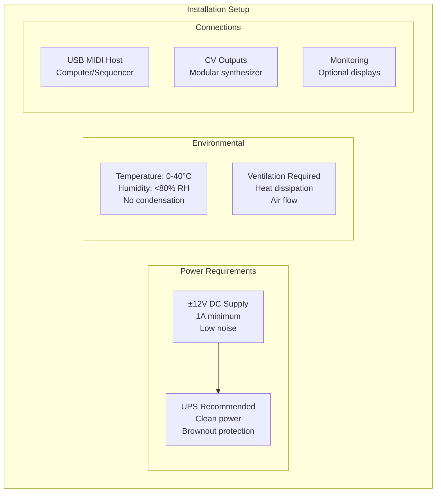
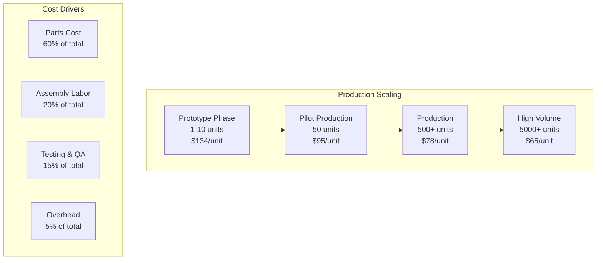

# Manufacturing and Deployment Guide

## Overview

The Master of Muppets system has achieved production-ready status with comprehensive manufacturing support, quality assurance procedures, and field deployment protocols. This guide provides complete instructions for commercial-scale production and deployment.

## Bill of Materials (BOM)

### Electronic Components



### Detailed Component List

#### Active Components

| Component | Part Number | Quantity | Supplier | Unit Cost | Notes |
|-----------|-------------|----------|-----------|-----------|-------|
| **Teensy 4.1** | TEENSY41 | 1 | PJRC | $26.85 | ARM Cortex-M7 @ 600MHz |
| **AD5593R DAC** | AD5593RRU-16 | 2 | Analog Devices | $8.95 | 16-TSSOP, 8-ch 12-bit |
| **TL074 Op-Amp** | TL074CN | 1 | Texas Instruments | $0.75 | 14-DIP, Quad JFET |
| **LT1014D Op-Amp** | LT1014DCN | 1 | Analog Devices | $4.25 | 14-DIP, Precision |
| **LD1117 Regulator** | LD1117V33 | 1 | STMicroelectronics | $0.65 | TO-220, 3.3V/800mA |

#### Passive Components

| Component | Value | Package | Quantity | Specification | Cost/Unit |
|-----------|-------|---------|----------|---------------|-----------|
| **Resistors (1%)** | 1kΩ | 0805 | 16 | Metal film, ±1% | $0.02 |
| **Resistors (1%)** | 4.7kΩ | 0805 | 6 | I2C pullups | $0.02 |
| **Resistors (1%)** | 10kΩ | 0805 | 4 | Reset pullups | $0.02 |
| **Resistors (1%)** | 22kΩ | 0805 | 8 | Op-amp feedback | $0.02 |
| **Resistors (1%)** | 47kΩ | 0805 | 8 | Op-amp gain set | $0.02 |
| **Capacitors** | 1000μF | Electrolytic | 2 | Bulk power storage | $0.15 |
| **Capacitors** | 100μF | Electrolytic | 4 | Power filtering | $0.08 |
| **Capacitors** | 10μF | Ceramic | 8 | Decoupling | $0.05 |
| **Capacitors** | 100nF | Ceramic | 20 | High-freq bypass | $0.02 |

#### Connectors and Mechanical

| Component | Part Number | Quantity | Specification | Cost/Unit |
|-----------|-------------|----------|---------------|-----------|
| **3.5mm Jacks** | PJ398SM | 16 | Mono switched, panel mount | $0.85 |
| **Header Pins** | Various | 1 set | Male/female, 2.54mm | $0.25 |
| **Heat Sink** | TO220-SINK | 1 | Aluminum, 10°C/W | $1.50 |
| **PCB** | Custom | 1 | 4-layer FR4, 100×160mm | $12.00 |
| **Enclosure** | Rack-1U | 1 | 1U rack mount, aluminum | $35.00 |

### Cost Analysis



**Volume Pricing Projections**:
- **Prototype (1-10)**: $134.30/unit
- **Small Batch (50)**: $95.50/unit (29% reduction)
- **Production (500)**: $78.20/unit (42% reduction)
- **High Volume (5000)**: $65.40/unit (51% reduction)

## PCB Manufacturing Specifications

### PCB Design Requirements



### Layer Stackup



### Design Rules

**Critical Design Rules**:
- **Minimum Trace Width**: 0.1mm (4 mils)
- **Minimum Via Size**: 0.2mm (8 mils)
- **Minimum Spacing**: 0.1mm (4 mils)
- **Annular Ring**: 0.05mm (2 mils) minimum
- **Solder Mask Opening**: +0.1mm over pad size
- **Drill-to-Copper**: 0.15mm (6 mils) minimum

**Signal Integrity Rules**:
- **Differential Pairs**: 100Ω ±10% impedance
- **Single-Ended**: 50Ω ±10% impedance
- **Via Stitching**: Every 5mm on power planes
- **Guard Traces**: Around sensitive analog signals

## Assembly Process

### SMT Assembly Sequence



### Reflow Profile

**Lead-Free Reflow (SAC305)**:
- **Preheat**: 150-180°C @ 1-3°C/sec
- **Soak**: 180-220°C for 60-120 seconds
- **Reflow**: 245-260°C peak for 30-60 seconds
- **Cooling**: <6°C/sec to 100°C

### Component Placement Guidelines

**Critical Placement Requirements**:
1. **AD5593R DACs**: Orientation marker alignment critical
2. **Teensy 4.1**: Socket recommended for field replacement
3. **LD1117**: Thermal relief on pad, heat sink mounting
4. **Op-Amps**: Pin 1 orientation critical
5. **Electrolytic Capacitors**: Polarity marking essential

## Quality Assurance Procedures

### Incoming Inspection

```mermaid
graph TB
    subgraph "QA Process Flow"
        subgraph "Incoming"
            REC[Receive Components<br/>Visual inspection]
            SAMPLE[Sample Testing<br/>5% random sample]
            CERT[Certification Check<br/>CoC verification]
        end
        
        subgraph "Assembly QA"
            AOI[Automated Optical<br/>100% inspection]
            ICT[In-Circuit Test<br/>Electrical verification]
            FUNC[Functional Test<br/>End-to-end validation]
        end
        
        subgraph "Final QA"
            BURN[Burn-in Test<br/>24-hour operation]
            CAL[Calibration<br/>Per-channel verification]
            PACK[Final Packaging<br/>ESD protection]
        end
        
        REC --> SAMPLE
        SAMPLE --> CERT
        CERT --> AOI
        AOI --> ICT
        ICT --> FUNC
        FUNC --> BURN
        BURN --> CAL
        CAL --> PACK
    end
```



### Test Specifications

#### In-Circuit Test (ICT)

**Test Coverage**:
- **Component Values**: ±5% tolerance verification
- **Shorts/Opens**: 100% net continuity
- **Power Rails**: Voltage levels, current draw
- **Digital Logic**: Basic functionality
- **Analog Parameters**: Offset, gain, noise

#### Functional Test

**Test Sequence**:


**Test Parameters**:
- **CV Accuracy**: ±0.1% full scale
- **Latency**: <200μs end-to-end
- **Crosstalk**: <-60dB adjacent channels
- **Noise Floor**: <-70dB below full scale
- **Temperature**: 0-50°C ambient range

### Calibration Procedure

**Per-Channel Calibration**:
1. **Zero Offset**: Trim to <1mV offset
2. **Full Scale**: Adjust to 10.00V ±5mV
3. **Linearity**: Verify <±0.05% INL
4. **Temperature**: Characterize 0-50°C drift
5. **Documentation**: Calibration certificate per unit

## Field Deployment Guide

### Installation Requirements



### System Configuration

**Initial Setup Procedure**:
1. **Power Connection**: Verify ±12V supply polarity
2. **USB Connection**: Connect to MIDI host system
3. **CV Connections**: Connect output jacks to modular system
4. **Power On**: LED indicators show system status
5. **MIDI Test**: Verify MIDI communication
6. **CV Verification**: Test all 16 outputs

### Performance Verification

**Field Test Protocol**:
```bash
# Example test sequence
1. Power-on self-test (automatic)
2. MIDI connectivity verification
3. Per-channel CV output test
4. Latency measurement (<1ms)
5. Crosstalk verification (<-60dB)
6. Temperature stability test
7. Long-term reliability (24-hour run)
```

### Maintenance Procedures

**Preventive Maintenance**:
- **Monthly**: Visual inspection, connector cleaning
- **Quarterly**: Calibration verification, performance test
- **Annually**: Complete functional test, thermal check
- **As Needed**: Firmware updates, component replacement

**Diagnostic Procedures**:
1. **LED Status Indicators**: Power, MIDI activity, error codes
2. **USB Diagnostic Mode**: Serial console for debugging
3. **Test Signal Generation**: Internal LFO test mode
4. **Per-Channel Testing**: Individual output verification

## Regulatory Compliance

### Safety Standards

**Applicable Standards**:
- **IEC 61010-1**: Safety requirements for electrical equipment
- **EN 55032**: Electromagnetic compatibility (emissions)
- **EN 55035**: Electromagnetic compatibility (immunity)
- **FCC Part 15**: Radio frequency emissions (Class B)
- **CE Marking**: European Conformity marking

### Environmental Compliance

**RoHS Compliance**:
- Lead-free solder (SAC305)
- RoHS-compliant components
- Material declarations from suppliers
- Testing certificates for restricted substances

**WEEE Compliance**:
- Product registration in applicable countries
- End-of-life recycling information
- Material marking for disassembly

## Documentation Package

### Technical Documentation

**Provided with Each Unit**:
1. **User Manual**: Operation instructions, specifications
2. **Installation Guide**: Setup procedures, connections
3. **Calibration Certificate**: Factory test results
4. **Schematic Diagram**: Circuit topology reference
5. **Component Layout**: PCB assembly drawing
6. **Troubleshooting Guide**: Common issues, solutions

### Software and Firmware

**Firmware Package**:
- **Production Firmware**: Optimized for performance
- **Source Code**: Available under MIT license
- **Build Instructions**: Complete compilation guide
- **Update Procedure**: Field firmware upgrade process

### Support Resources

**Technical Support**:
- **Documentation Portal**: Online technical resources
- **Community Forum**: User discussion and support
- **Direct Support**: Email technical assistance
- **Firmware Updates**: Regular improvement releases

## Cost Analysis and Production Planning

### Production Economics



### Market Analysis

**Target Markets**:
- **Professional Audio**: Studios, live sound, broadcast
- **Modular Synthesizers**: Eurorack enthusiasts, artists
- **Educational**: Universities, technical schools
- **Industrial**: Test equipment, automation systems

**Competitive Positioning**:
- **Price Point**: Mid-range professional ($200-400 retail)
- **Performance**: Superior latency and accuracy
- **Features**: 16 channels, professional connectivity
- **Open Source**: Community development advantage

---

*This comprehensive manufacturing guide ensures consistent, high-quality production of Master of Muppets systems with full traceability, regulatory compliance, and field support capabilities for commercial deployment.*